# Q1

## Empirical Elastic Response Spectra

Given the characteristics of the structural system, which is classified to be of importance class IV. Accordign to the EN1998-1 guidelines, $\gamma_I$ takes a value of 1.4. The acceleration of the ground is equal to 0.37$m/s^2$, which results in a PGA of 0.518$m/s^2$. Using a damping of 4.2%, gives the following elastic acceleration spectra of the scaled signals along each principal direction:

- First horizontal direction

- Second horizontal direction

- Vertical direction

Taking the average of the sets for each direction, gives the elastic response spectra for each.

**EXPLAIN DIFFERENCE WITH THE ONE IN THE EUROCODE.

# Q2

## Empirical Inelastic Response Spectra

Computing the inelastic acceleration response spectra for the $R_y - \mu - T$ relationship based on Newmark and Hall, using the mean ERS along the two principal horizontal directions, gives the following spectra:

Computing the constant ductility inelastic acceleration response spectra of the five signals in question when
decomposed along the two principal horizontal directions, gives the following spectra:

**EXPLAIN DIFFERENCES

# Q3

## Structural Model Used for the Pushover Analysis

The nonlinear static pushover analysis was carried out on the three-dimensional frame model shown in Figure 1. The nonlinearity was introduced by assigning plastic hinges to the moment-resisting frame members and by defining hinge behaviour at the bases of the bottom columns. In this way, the model is able to capture the progressive formation of plastic mechanisms as the lateral load is increased.

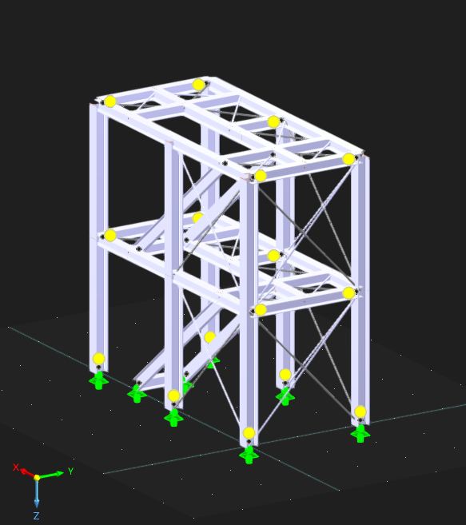

*Figure 1. RFEM model adopted for the pushover analysis.*

## Elastic Response Spectrum

The pushover demand was defined in RFEM using the horizontal elastic response spectrum of EN 1998-1. According to the assignment setup, the following spectrum properties were used:

- Spectrum type: Type 2
- Ground type: D
- Soil factor: $S = 1.80$
- Lower limit of constant spectral acceleration branch: $T_B = 0.10\ \mathrm{s}$
- Upper limit of constant spectral acceleration branch: $T_C = 0.30\ \mathrm{s}$
- Displacement-controlled branch limit: $T_D = 1.20\ \mathrm{s}$
- Structural damping ratio: $\xi = 5\%$
- Damping correction factor: $\eta = 1.0$
- Behaviour factor for elastic spectrum: $q = 1.0$
- Importance factor: $\gamma_I = 1.4$

The assignment defines the design ground acceleration as

$$
a_{gR} = \,(0.35 + 0.0C)\,g
$$

Using the student-ID digits adopted in the current project files,

$$
(A,B,C,D,E,F,G) = (6,6,1,1,2,5,7),
$$

and therefore $C = 1$, so

$$
PGA = \gamma_I\,(0.35 + 0.01)\,g = 0.504\,g
$$

## Modal Basis and Choice of Analysis Direction

Before running the nonlinear static analysis, a modal analysis was performed in RFEM6. The first 20 modes were extracted. From the modal mass table, one mode clearly governs each horizontal translational direction:

| Mode | lambda [1/s^2] | omega [rad/s] | f [Hz] | T [s] | meX [kg] | meY [kg] | fmeX [-] | fmeY [-] | Governing direction |
| --- | ---: | ---: | ---: | ---: | ---: | ---: | ---: | ---: | --- |
| 1 | 282.938 | 16.821 | 2.677 | 0.374 | 82.0 | 13119.2 | 0.004 | 0.645 | global y |
| 7 | 3588.673 | 59.906 | 9.534 | 0.105 | 15936.9 | 39.4 | 0.784 | 0.002 | global x |

Thus, mode 1 is the governing translational mode in the global $y$ direction, while mode 7 is the governing translational mode in the global $x$ direction. 

The cumulative translational modal mass captured by the first 20 modes is:
- $\Sigma f_{meX} = 0.841$, corresponding to $84.13\%$ of the total mass in the global $x$ direction.
- $\Sigma f_{meY} = 0.933$, corresponding to $93.26\%$ of the total mass in the global $y$ direction.
- $\Sigma f_{meZ} = 0.151$, corresponding to $15.08\%$ of the total mass in the global $z$ direction.

The pushover analysis is performed in the global $y$ direction using the first mode as the load pattern. This choice is justified because mode 1 dominates the translational response in $y$, with an effective modal mass of $13119.2\ \mathrm{kg}$ and a modal mass participation factor of $0.645$. In addition, this mode has the largest relevant horizontal period, namely

$$
T_1 = 0.374\ \mathrm{s}
$$

which indicates that the structure is more flexible in the $y$ direction than in the $x$ direction. Therefore, the $y$ direction is expected to govern the lateral displacement demand and is the most appropriate direction for the pushover assessment.

## Analysis Setup

The nonlinear static analysis is therefore defined as follows:

- Lateral loading direction: global $y$ direction.
- Load pattern: first mode shape.
- Governing mode properties: $\omega_1 = 16.821\ \mathrm{rad/s}$, $f_1 = 2.677\ \mathrm{Hz}$, $T_1 = 0.374\ \mathrm{s}$.
- Effective modal mass in $y$: $m_{eY,1} = 13119.2\ \mathrm{kg}$.
- Effective modal mass ratio in $y$: $f_{meY,1} = 0.645$.
- Solution procedure: Newton-Raphson iteration.
- Termination criterion: analysis continued until structural collapse or numerical non-convergence.

This setup ensures that the pushover curve is generated in the direction that is dynamically most representative for the structure and that the applied lateral forces are consistent with the dominant deformation pattern obtained from modal analysis.

## Capacity-Spectrum Assessment

In the pushover procedure, the MDOF structure is converted into an equivalent SDOF system and the nonlinear capacity curve is expressed in ADRS form, that is, spectral acceleration versus spectral displacement. The demand is represented by the EN 1998-1 elastic spectrum. Following the procedure used in the course notes, the displacement demand is not taken from the horizontal plateau of the bilinear capacity curve. Instead, the yield point of the bilinearized spectrum is first identified and the initial elastic branch is extended from the origin. The demand is then read from the point where this elastic branch corresponds to the elastic spectrum.

For the present case, the selected lateral load pattern is modal and acts in the global $y$ direction, using the first mode shape. This is consistent with the modal analysis, since mode 1 is the governing translational mode in $y$ and carries the largest relevant effective mass in that direction.

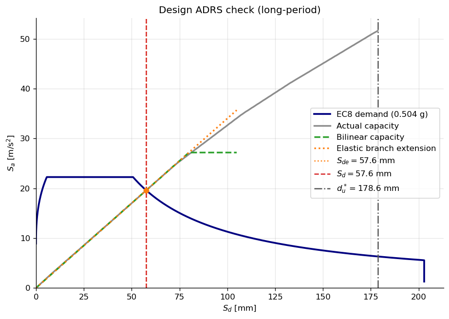

*Figure 3. ADRS representation of the EC8 demand spectrum and the pushover capacity spectrum in the governing $y$ direction. The orange dotted line is the extension of the elastic branch used to read $S_{de}$, while the short horizontal green segment indicates the beginning of the bilinear post-yield plateau.*

From the exported bilinear capacity spectrum, the yield point is

$$
S_{dy}=79.9\ \mathrm{mm}, \qquad S_{ay}=27.17\ \mathrm{m/s^2}.
$$

This yields an equivalent period

$$
T^\ast = 2\pi\sqrt{\frac{S_{dy}}{S_{ay}}}=0.341\ \mathrm{s}.
$$

Since

$$
T^\ast > T_C = 0.30\ \mathrm{s},
$$

the structure falls in the long-period range. Therefore, according to the ADRS procedure, the equal-displacement rule applies and the target displacement is taken directly from the elastic-spectrum point associated with the extended elastic branch:

$$
S_{de}=57.6\ \mathrm{mm}, \qquad S_d = S_{de}=57.6\ \mathrm{mm}.
$$

The usable displacement capacity of the actual pushover curve is

$$
d_u^\ast = 178.6\ \mathrm{mm}.
$$

Hence,

$$
S_d < d_u^\ast,
$$

which shows that the displacement demand remains well below the available displacement capacity. For the design spectrum defined by

$$
a_g = 0.504\,g,
$$

the structure satisfies the displacement-based seismic demand of the pushover check.

By scaling the design spectrum incrementally, the limiting acceleration at which the target displacement reaches the capacity is found to be approximately

$$
a_{g,\mathrm{fail}} \approx 1.56\,g.
$$

Therefore, the structure remains safe for the assignment design acceleration and would only reach its displacement capacity at a substantially larger seismic demand level.

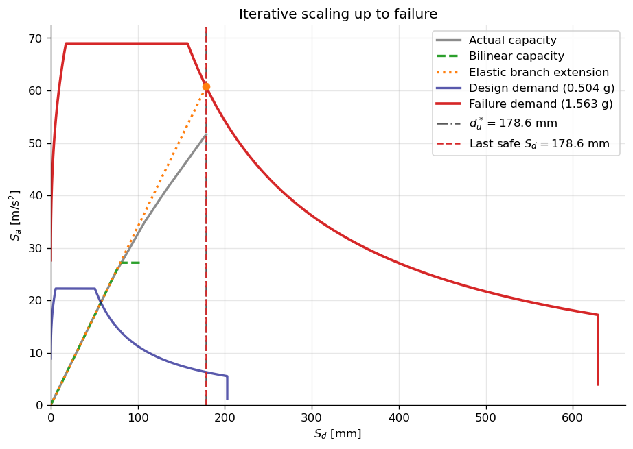

*Figure 4. Iterative scaling of the demand spectrum up to the limiting acceleration. The orange dotted line is extended up to the contact point with the scaled demand spectrum, and the orange marker indicates the last safe point where the target displacement reaches the displacement capacity. The short horizontal green segment shows the start of the bilinear plateau after yield.*

Figure 4 confirms the failure-search procedure. The design demand spectrum for $a_g=0.504\,g$ remains far below the displacement limit, whereas the scaled spectrum associated with

$$
a_{g,\mathrm{fail}} \approx 1.56\,g
$$

reaches the capacity at the contact point defined by the extension of the elastic branch,

$$
S_d \approx d_u^\ast = 178.6\ \mathrm{mm}.
$$

This provides the requested limiting acceleration for the chosen modal pushover pattern in the global $y$ direction.

## Comparison of lateral-load patterns and applicability of pushover analysis

In accordance with EN 1998-1, Section 4.3.3.4.2.2, both uniform and modal lateral-load distributions were considered in each principal horizontal direction. The uniform pattern was defined using lateral forces proportional to the masses, independently of elevation. The modal pattern was based on the dominant translational mode in the direction under consideration.

In the $Y$-direction, Mode 1 is the dominant translational mode. It has a natural period of

$$
T_1 = 0.374\ \text{s}
$$

and an effective modal-mass ratio of

$$
f_{\mathrm{meY},1} = 64.5\%.
$$

The modal pushover pattern in the $Y$-direction was therefore based on Mode 1.

Nevertheless, the response in the $Y$-direction is not completely dominated by this mode. Mode 4 contributes an additional $22.2\%$ of the effective translational mass in the $Y$-direction. Modes 1 and 4 together account for

$$
64.5\% + 22.2\% = 86.7\%
$$

of the total effective mass in the $Y$-direction. Including Mode 9 increases the cumulative effective modal-mass ratio to approximately

$$
64.5\% + 22.2\% + 4.7\% = 91.4\%.
$$

Furthermore, Mode 4 has a rotational effective modal-mass ratio about the vertical $Z$-axis of approximately

$$
f_{\mathrm{m}\varphi Z,4} = 47.8\%,
$$

indicating coupled translational and torsional behaviour.

Based on these modal characteristics, an additional lateral-load pattern may be relevant in the $Y$-direction. Although Mode 1 is the dominant mode, it accounts for only $64.5\%$ of the effective translational mass, while Mode 4 makes a substantial additional contribution and exhibits significant torsional participation. Therefore, a higher-mode pattern based on Mode 4, a multimodal pattern combining Modes 1 and 4, or an adaptive pushover distribution could provide additional information regarding the sensitivity of the structural response to the assumed lateral-load distribution.

Conventional pushover analysis is most applicable when the structural response is dominated by a principal translational mode, with limited contribution from translation in the orthogonal horizontal direction and from torsional deformation. For Mode 1, the effective modal-mass ratio in the orthogonal $X$-direction is only

$$
f_{\mathrm{meX},1} = 0.4\%,
$$

while the rotational effective modal-mass ratio about the vertical $Z$-axis is approximately

$$
f_{\mathrm{m}\varphi Z,1} = 17.7\%.
$$

The very small contribution in the orthogonal $X$-direction indicates that Mode 1 is predominantly translational in the $Y$-direction. Although some torsional coupling is present, the response remains primarily governed by $Y$-translation. Consequently, pushover analysis is considered an appropriate method for estimating the global seismic capacity of the structure in the $Y$-direction. However, the contribution of Mode 4 and its significant torsional component should be considered when interpreting the results.

# Q4

## Time History Analysis

A computational routine was developed to construct the Elastic Response Spectra (ERS) for each principal direction of the unscaled ground motions. The algorithm applies a peak ground acceleration (PGA) scaling factor in accordance with the target design spectrum, defined by a structural damping ratio of 4.2%. The time-domain signals were converted into the frequency domain using numerical integration, yielding the Spectral Acceleration ($SA$) as a function of the natural period ($T_n$). This allows for a direct comparison between the energy demands of the earthquakes and the resonant frequencies of the structure.

The response spectra of the 5 scaled acceleration signals along principal directions are derived in ERS.ipynb. From which we can observe that the response spectra is almost identical for Horizontal 1 and Horizontal 2, and all 5 sets show a peak between a natural period of roughly 0.3~0.5 [s]. 

After conducting modal analysis of our selected structure in RFEM6, we get natural frequencies for the first 20 modes, and their corresponding modal effective modal masses: 
| Mode No. | Eigenvalue λ [1/s2] | Angular Frequency ω [rad/s] | Natural Frequency f [Hz] | Natural Period T [s] |
| :--- | :--- | :--- | :--- | :--- |
| 1 | 898.775 | 29.980 | 4.771 | 0.210 |
| 2 | 5761.336 | 75.903 | 12.080 | 0.083 |
| 3 | 5785.167 | 76.060 | 12.105 | 0.083 |
| 4 | 9005.584 | 94.898 | 15.103 | 0.066 |
| 5 | 10077.998 | 100.389 | 15.977 | 0.063 |
| 6 | 13377.216 | 115.660 | 18.408 | 0.054 |
| 7 | 13715.399 | 117.113 | 18.639 | 0.054 |
| 8 | 15598.965 | 124.896 | 19.878 | 0.050 |
| 9 | 21885.597 | 147.938 | 23.545 | 0.042 |
| 10 | 21888.438 | 147.947 | 23.547 | 0.042 |
| 11 | 21943.938 | 148.135 | 23.576 | 0.042 |
| 12 | 26491.293 | 162.761 | 25.904 | 0.039 |
| 13 | 26528.471 | 162.876 | 25.922 | 0.039 |
| 14 | 26536.380 | 162.900 | 25.926 | 0.039 |
| 15 | 26540.139 | 162.911 | 25.928 | 0.039 |
| 16 | 26542.579 | 162.919 | 25.929 | 0.039 |
| 17 | 26561.188 | 162.976 | 25.938 | 0.039 |
| 18 | 35432.434 | 188.235 | 29.959 | 0.033 |
| 19 | 35815.411 | 189.250 | 30.120 | 0.033 |
| 20 | 46175.032 | 214.884 | 34.200 | 0.029 |

| Mode No. | Mi [kg] | meX | meY | meZ | fmeX | fmeY | fmeZ |
| :--- | :--- | :--- | :--- | :--- | :--- | :--- | :--- |
| 1 | 1092.0 | 2.6 | 3278.3 | 0.4 | 0.000 | 0.606 | 0.000 |
| 2 | 117.8 | 5.5 | 100.7 | 0.4 | 0.001 | 0.019 | 0.000 |
| 3 | 109.6 | 0.0 | 0.1 | 0.0 | 0.000 | 0.000 | 0.000 |
| 4 | 1194.3 | 2672.1 | 374.3 | 147.7 | 0.494 | 0.069 | 0.027 |
| 5 | 1285.6 | 1172.3 | 730.6 | 60.1 | 0.217 | 0.135 | 0.011 |
| 6 | 78.7 | 2.3 | 0.5 | 0.0 | 0.000 | 0.000 | 0.000 |
| 7 | 83.5 | 0.1 | 0.3 | 5.3 | 0.000 | 0.000 | 0.001 |
| 8 | 247.0 | 653.8 | 0.1 | 515.4 | 0.121 | 0.000 | 0.095 |
| 9 | 20647274.8 | 0.0 | 0.0 | 0.0 | 0.000 | 0.000 | 0.000 |
| 10 | 3507897.2 | 0.0 | 0.0 | 0.1 | 0.000 | 0.000 | 0.000 |
| 11 | 23215.5 | 2.1 | 0.0 | 6.8 | 0.000 | 0.000 | 0.001 |
| 12 | 509090.4 | 0.0 | 0.4 | 0.0 | 0.000 | 0.000 | 0.000 |
| 13 | 1200495.8 | 0.0 | 0.3 | 0.0 | 0.000 | 0.000 | 0.000 |
| 14 | 2438040.6 | 0.0 | 0.1 | 0.0 | 0.000 | 0.000 | 0.000 |
| 15 | 2685648.4 | 0.0 | 0.1 | 0.0 | 0.000 | 0.000 | 0.000 |
| 16 | 3768861.5 | 0.0 | 0.0 | 0.0 | 0.000 | 0.000 | 0.000 |
| 17 | 2156375.0 | 0.0 | 0.2 | 0.0 | 0.000 | 0.000 | 0.000 |
| 18 | 90002.0 | 0.0 | 7.4 | 0.0 | 0.000 | 0.001 | 0.000 |
| 19 | 1641.5 | 0.2 | 394.4 | 0.5 | 0.000 | 0.073 | 0.000 |
| 20 | 13617.6 | 0.0 | 0.1 | 0.7 | 0.000 | 0.000 | 0.000 |
| Σ | 37046368.9 | 4511.3 | 4888.0 | 737.3 | 0.834 | 0.904 | 0.136 |
| ΣM | | 5408.2 | 5408.2 | 5408.2 | | | |
| % | | 83.42 | 90.38 | 13.63 | | | |

From which we can see that the x-axis is governed by mode 4 (effective modal mass factor 0.494) and the y-axis by mode 1 (effective modal mass factor 0.606), according to the dominant modal mass contribution compared to the other modes. Mode 4, governing for the x-axis has a fundamental period of 0.066[s] and an effective modal mass of 1194.3[kg]. Mode 1, governing for the y-axis has a fundamental period of 0.21[s] and an effective modal mass of 1092[kg]. 

We set these two fundamental periods into the derived response spectra. 

Figure 1: Elastic Acceleration Response Spectra - Horizontal 1

Figure 2: Elastic Acceleration Response Spectra - Horizontal 2

The structural frame exhibits governing natural periods of Tx = 0.066 s for the X-direction and Ty = 0.21 s for the Y-direction. Because both principal axes are mechanically stiff, they fall directly within the high-acceleration plateau (the resonant peak zones) of standard seismic response spectra. Rather than dissipating energy through large physical displacements, the structure is highly vulnerable to attracting massive inertial forces during a seismic event.

To perform a rigorous Ultimate Limit State (ULS) capacity check, the structure must be evaluated against the ground motion that produces the most severe concurrent internal stresses. An algorithmic search of the provided response spectra identified Set 4 as the absolute worst-case scenario due to a critical dual-resonance phenomenon:

CRITICAL EXCITATION SEARCH RESULTS:

Target Period for X-direction: Tx = 0.066 s

Target Period for Y-direction: Ty = 0.21 s
- The most critical excitation is Set 4
- Align Horizontal 1 to X-axis, Horizontal 2 to Y-axis
- Resulting SA at Tx = 1.504 g
- Resulting SA at Ty = 0.925 g
- Total Combined SA Demand = 2.429 g

X-Axis Maximization (Horizontal 1): The primary horizontal component of Set 4 contains immense high-frequency energy, featuring a sharp spectral acceleration peak precisely in the ultra-short period range. Aligning this component with the structure's X-axis (Tx = 0.066 s) forces the stiffest lateral system to absorb an extreme peak spectral acceleration of 1.504 g. This direct resonance guarantees the maximum possible base shear and overturning moments in the X-direction.

Y-Axis Maximization (Horizontal 2): Concurrently, the orthogonal component of Set 4 (Horizontal 2) exhibits a distinct spectral peak that crests precisely across the 0.20 to 0.30 s range. By aligning this specific excitation component with the Y-axis (Ty = 0.21 s), the orthogonal structural system is hit with near-peak acceleration demands at the exact same moment the X-axis is maximized.

## Maximum displacements and stresses based on the Time History Analysis

The time history analysis was conducted with the two horizontal excitations inputted accordingly into the corresponding x and y axes in an accelerogram. Implementing the linear modal analysis rather than linear implicit Neumark to save computational time. The time step was 0.01[s] with split saved time steps of 10. 

The maximum displacement resulting from the time history analysis are as follows: 
| Description | Value | Unit | Notes |
| :--- | :--- | :--- | :--- |
| Maximum displacement in X-direction | 2.8 | mm | Member No. 222, x: 1.000 m |
| Maximum displacement in Y-direction | -11.2 | mm | Member No. 27, x: 2.470 m |
| Maximum displacement in Z-direction | -1.1 | mm | Member No. 218, x: 3.886 m |
| Maximum vectorial displacement | 11.5 | mm | Member No. 27, x: 2.470 m |
| Maximum rotation about X-axis | -6.6 | mrad | Member No. 476, x: 0.170 m |
| Maximum rotation about Y-axis | -0.8 | mrad | Member No. 1, x: 0.000 m |
| Maximum rotation about Z-axis | 2.3 | mrad | Member No. 220, x: 3.886 m |

The maximum deformation for both X and Y were observed at the roof members. This makes sense because structural deflections compound upward. The free end of the global cantilever experiences the summation of the inter-story drifts from all lower levels, resulting in maximum absolute displacement at the highest elevation.

Although the structure was subjected to extreme spectral acceleration along its X-axis ($T_x = 0.066 \text{ s}$) and relatively low acceleration along its Y-axis ($T_y = 0.21 \text{ s}$), the recorded displacement in the Y-direction was approximately four times larger than in the X-direction. 

The relationship between Spectral Acceleration ($SA$) and Spectral Displacement ($SD$) is strictly period-dependent, defined by the formula:

$$SD = SA \cdot \frac{T^2}{4\pi^2}$$

This mathematical relationship demonstrates that displacement demand grows exponentially with the structural period. Calculating the displacement multipliers for both axes yields: 

X-Axis: $\frac{0.066^2}{4\pi^2} \approx 0.00011$

Y-Axis: $\frac{0.210^2}{4\pi^2} \approx 0.00111$

The fundamental flexibility of the Y-axis gives it a theoretical displacement sensitivity roughly 10 times greater than the X-axis. Therefore, even though the Y-axis was subjected to a significantly lower inertial force, its lack of stiffness allowed it to undergo massive physical deformations. The X-axis acted as a rigid block—attracting massive base shear and stress but resisting deformation—while the Y-axis acted as a flexible rod, shedding stress but experiencing extreme drift.

On the other hand, the maximum internal forces are summarized as follows : 
|  Member No. | Location x [m] | Stress Point No. | Loading No. | Stress Type | Existing Stress [N/mm²] | Limit Stress [N/mm²] | Stress Ratio η [--] |
 | :--- | :--- | :--- | :--- | :--- | :--- | :--- | :--- |
442 | 0.980 | 21 | CO91 | σx,tot | 13.303 | 350.000 | 0.038 |
 476 | 0.170 | 11 | CO91 | τtot | -8.519 | 202.073 | 0.042 |
 476 | 0.170 | 11 | CO91 | σeqv,von Mises | 14.757 | 350.000 | 0.042 |

The time history analysis reveals that the critical internal stresses are heavily concentrated at the base of the lowest-story columns. As evidenced in the visual below, the maximum axial, shear, and von mises stresses all occur on the first floor of the structure. 

Figure 3: Stress point No. 11 (location of max shear and von mises stress)
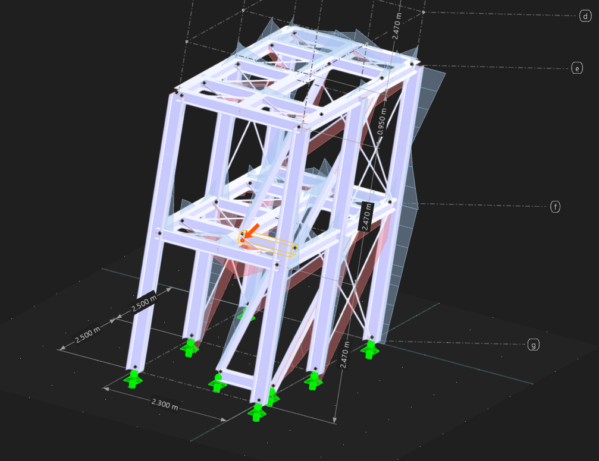
Figure 4: Stress point No. 21 (location of max axial stress)

Under global lateral excitation, the multi-story frame behaves macroscopically as a vertical cantilever. The inertial forces generated by the mass of each floor level accumulate downwards through the load path. Consequently, the base columns must resist the maximum global base shear. Furthermore, the lateral sway of the upper stories generates a massive global overturning moment. As the building oscillates, the exterior columns parallel to the direction of motion experience alternating cycles of extreme axial compression and tension, coupled with maximum bending stress. This combined stress state makes the foundation-level boundary elements the most critical components for seismic capacity.

# Conclusion on the capacity of the structure

To determine the final seismic capacity of the structure, the maximum dynamic demands (internal forces and global displacements) obtained from the time history analysis must be evaluated against the mechanical resistance of the frame. The structure is composed of HEB 240 cross-sections utilizing S355 structural steel.

RFEM calculates the unity check value of the maximum stresses against the maximum resistance of the specific member. It is evident that the unity check is satisfactory with a value of 0.038, 0.042, and 0.042 respectively for axial, shear, and von mises stresses. 

Seismic capacity is also governed by lateral stiffness to prevent structural instability (P-Delta effects) and severe damage. The total height of the structure is H = 4.94 [m].The maximum absolute deformation occurred at the roof level in the flexible Y-direction:Max Global Displacement ($\Delta_{max}$): 11.5[mm]

The global drift ratio ($\theta$) is calculated as:$$\theta = \frac{\Delta_{max}}{H} = \frac{11.5 \text{ mm}}{4940\text{ mm}} = 0.00233 \text{ rad} \approx \mathbf{0.23\%}$$A global drift ratio of 0.23% is well within standard acceptable limits for the ultimate limit state of steel frames under seismic loading (which typically allow drifts under 0.5% to ensure life safety and prevent collapse).

The dynamic time history analysis proves that the structure has sufficient seismic capacity. The substantial cross-sectional area of the HEB 240 columns ensures that internal stresses remain at roughly 4% of the S355 steel's yield threshold, while the overall frame stiffness restricts global deformations to a safe 0.23% drift ratio. Therefore, the building will comfortably survive the assigned bi-directional seismic event with no structural damage.

A comparative review of the global structural demands reveals a substantial discrepancy between the results of the Response Spectrum Analysis (Q5) and the linear Time History Analysis (Q4). The global displacements and internal stresses derived from the RSA significantly exceed those obtained from the THA—with the maximum RSA displacement in the Y-direction (34.2 mm) nearly tripling the corresponding THA displacement (11.5 mm). The remainder of this report is dedicated to justifying the reasoning behind the disrepancy between the results of RSA and THA.

# Q5

## Response Spectrum Analysis

A modal analysis was performed based on the existing finite element model of the structure. As requested, the amount of modes captured was limited to five, each including the corresponding natural frequency and modal participation mass per mode and per direction. From it, the following eigenmodes were obtained for the first five modes:

### First Mode

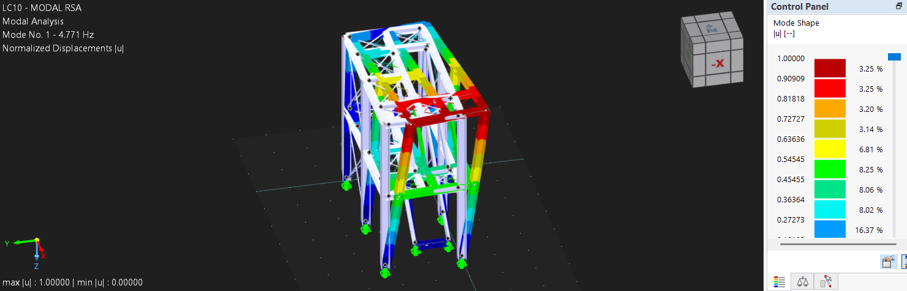

Figure 1. First eigenmode of the structure, with $f_1 = 4.771\,\mathrm{Hz}$ and normalized displacement magnitude shown by the color contour.

### Second Mode

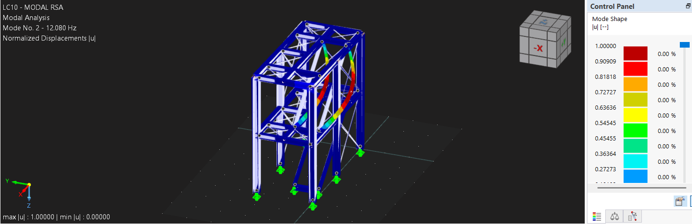

Figure 2. Second eigenmode of the structure, with $f_2 = 12.080\,\mathrm{Hz}$ and normalized displacement magnitude shown by the color contour.

### Third Mode

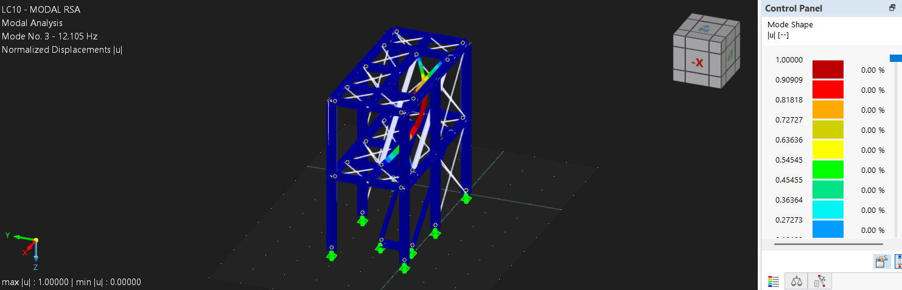

Figure 3. Third eigenmode of the structure, with $f_3 = 12.106\,\mathrm{Hz}$ and normalized displacement magnitude shown by the color contour.

### Fourth Mode

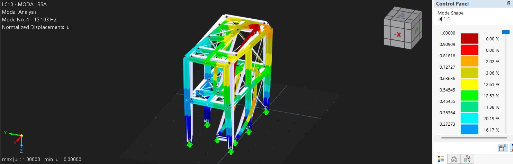

Figure 4. Fourth eigenmode of the structure, with $f_4 = 15.103\,\mathrm{Hz}$ and normalized displacement magnitude shown by the color contour.

### Fifth Mode

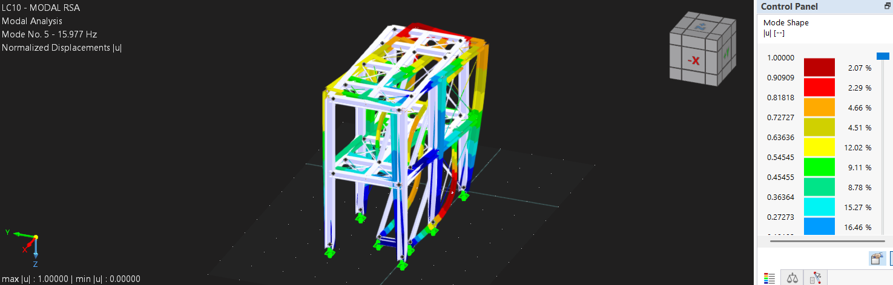

Figure 5. Fifth eigenmode of the structure, with $f_5 = 15.977\,\mathrm{Hz}$ and normalized displacement magnitude shown by the color contour.

The obtained eigenmodes of the structure have the following characteristics: 

| Mode No. | Eigenvalue $\lambda$ [1/s2] | Angular Frequency $\omega$ [rad/s] | Natural Frequency f [Hz] | Natural Period T [s] |
| :---: | :---: | :---: | :---: | :---: |
| 1 | 898.775 | 29.980 | 4.771 | 0.210 |
| 2 | 5761.336 | 75.903 | 12.080 | 0.083 |
| 3 | 5785.167 | 76.060 | 12.106 | 0.083 |
| 4 | 9005,584 | 94.898 | 15.103 | 0.066 |
| 5 | 10077.998 | 100.389 | 15.977 | 0.063 |

Based on the modal analysis, the modal participation mass for each of the five modes per direction was obtained:

<table>
	<thead>
		<tr>
			<th rowspan="2">Mode No.</th>
			<th rowspan="2">Modal Mass Mi [kg]</th>
			<th colspan="3">Effective Modal Mass - Translational Direction [kg]</th>
			<th colspan="3">Effective Modal Mass - Rotational Direction [kg]</th>
			<th colspan="3">Factor for Effective Modal Mass - Translational Direction</th>
			<th colspan="3">Factor for Effective Modal Mass - Rotational Direction</th>
		</tr>
		<tr>
			<th>meX</th>
			<th>meY</th>
			<th>meZ</th>
			<th>meφX</th>
			<th>meφY</th>
			<th>meφZ</th>
			<th>fmeX</th>
			<th>fmeY</th>
			<th>fmeZ</th>
			<th>fmeφX</th>
			<th>fmeφY</th>
			<th>fmeφZ</th>
		</tr>
	</thead>
	<tbody>
		<tr>
			<td>1</td>
			<td>1092.0</td>
			<td>2.6</td>
			<td>3278.3</td>
			<td>0.4</td>
			<td>1793.40</td>
			<td>1.40</td>
			<td>4355.65</td>
			<td>0.000</td>
			<td>0.606</td>
			<td>0.000</td>
			<td>0.103</td>
			<td>0.000</td>
			<td>0.190</td>
		</tr>
		<tr>
			<td>2</td>
			<td>117.8</td>
			<td>5.5</td>
			<td>100.7</td>
			<td>0.4</td>
			<td>25.93</td>
			<td>2.49</td>
			<td>1169.13</td>
			<td>0.001</td>
			<td>0.019</td>
			<td>0.000</td>
			<td>0.001</td>
			<td>0.000</td>
			<td>0.051</td>
		</tr>
		<tr>
			<td>3</td>
			<td>109.6</td>
			<td>0.0</td>
			<td>0.1</td>
			<td>0.0</td>
			<td>0.02</td>
			<td>0.00</td>
			<td>1.09</td>
			<td>0.000</td>
			<td>0.000</td>
			<td>0.000</td>
			<td>0.000</td>
			<td>0.000</td>
			<td>0.000</td>
		</tr>
		<tr>
			<td>4</td>
			<td>1194.3</td>
			<td>2672.1</td>
			<td>374.3</td>
			<td>147.7</td>
			<td>15.63</td>
			<td>1012.51</td>
			<td>3208.44</td>
			<td>0.494</td>
			<td>0.069</td>
			<td>0.027</td>
			<td>0.001</td>
			<td>0.034</td>
			<td>0.140</td>
		</tr>
		<tr>
			<td>5</td>
			<td>1285.6</td>
			<td>1172.3</td>
			<td>730.6</td>
			<td>60.1</td>
			<td>146.86</td>
			<td>456.40</td>
			<td>8854.09</td>
			<td>0.217</td>
			<td>0.135</td>
			<td>0.011</td>
			<td>0.008</td>
			<td>0.015</td>
			<td>0.387</td>
		</tr>
		<tr>
			<td>Σ</td>
			<td>3799.4</td>
			<td>3852.6</td>
			<td>4484.0</td>
			<td>208.6</td>
			<td>1981.84</td>
			<td>1472.82</td>
			<td>17588.41</td>
			<td>0.712</td>
			<td>0.829</td>
			<td>0.039</td>
			<td>0.114</td>
			<td>0.049</td>
			<td>0.768</td>
		</tr>
		<tr>
			<td>ΣM</td>
			<td></td>
			<td>5408.2</td>
			<td>5408.2</td>
			<td>5408.2</td>
			<td>17412.78</td>
			<td>29768.39</td>
			<td>22898.75</td>
			<td></td>
			<td></td>
			<td></td>
			<td></td>
			<td></td>
			<td></td>
		</tr>
		<tr>
			<td>%</td>
			<td></td>
			<td>71.24</td>
			<td>82.91</td>
			<td>3.86</td>
			<td>11.38</td>
			<td>4.95</td>
			<td>76.81</td>
			<td></td>
			<td></td>
			<td></td>
			<td></td>
			<td></td>
			<td></td>
		</tr>
	</tbody>
</table>

As it can be observed from the previous results, the total modal participation mass of the five modes is below the prescribed minimum of 90% of the total mass, this holds for all directions. This means that if performed with this amount of modes, the analysis could not be concluded to be accurate enough to represent the real behavior of the structure due to seismic loading. Further on, the modal participation mass of some modes in certain directions can be observed to be almost negligible. To ensure the analysis is performed within the requirements as well as in an efficient manner, it will be ensured that a right amount of modes are chosen so that the total modal participation mass reaches 90% of the total mass, and modes which can be neglected will not be taken into account for the calculation. 

## Choice of the modal upper bound and sensitivity anaysis

As stated above, the amount of modes chosen previously (5 modes) was not sufficient for the total participation mass to be 90% of the modal mass. Therefore, more modes need to be taken into account. Additionally, the scope for directions of the seismic input motion is limited, and only the translational motion in the x- and y-direction will be taken into account. This choice is made based on the fact that the derived Empirical Response Spectra in Questions 1 and 2 show that the magnitude of the soil accelerations in the horizontal principal directions is much greater than for the vertical one. Next to it, the rotational directions are also not accounted for for simplicity. 

To ensure the total modal mass participation reached the prescribed minimum, the first 102 modes of the structure were selected. This gave a total modal participation mass which was 91.16% of the total mass in the x-direction and 92.43% in the y-direction. This was the minimum amount of modes to fulfill this requirement. Even though a lot of the selected modes have a very small modal participation mass, modes which had a modal participation mass smaller than 0.3% of the total mass in both x- and y-direction were neglected, following the regulations of EN 1998-1. This meant that only 21 out of the 102 modes were relevant for the calculation, making the analysis much more efficient. 

Based on this, we can conclude that the current results are very sensitive to the chosen modes, as if we had continued with the initial 5 modes, we would have reached a total modal mass participation of 71.24% and 82.91% respectively. Based on this, we can conclude that the design outputs are highly sensitive to the upper limit of modes considered. Truncating the analysis at the initial 5 modes would omit approximately 20% of the dynamically participating mass in the X-direction. This would yield an artificial reduction in base shear, leading to a fundamentally unsafe underestimation of internal forces and structural displacement

## Maximum displacements and stresses based on the Response Spectrum Analysis

The maximum displacements located at their corresponding critical cross-sections which follow from the Response Spectra Analysis are the following: 

### Serviceability Limit State (SLS) – Deflection and Rotation Summary

The global displacement and rotation analysis highlights that the most significant structural movement occurs as lateral drift/deflection along the Y-axis. Below is the detailed breakdown written in standard phrasing:

#### Global Displacements

* **Maximum Displacement in the X-Direction (Longitudinal):** The peak longitudinal movement reaches **6.5 mm**. This occurs on **Member No. 28** at a distance of **2.470 m**.

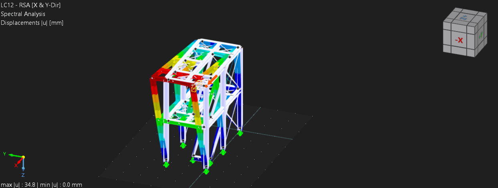

* **Maximum Displacement in the Y-Direction (Lateral):** The largest movement in the entire structure occurs along the Y-axis, reaching **34.2 mm**. This peak deflection is located on **Member No. 27** at a distance of **2.470 m**.

* **Maximum Displacement in the Z-Direction (Vertical):** Vertical deflection remains very low, peaking at **3.7 mm**. This is located on **Member No. 218** at a distance of **3.886 m**.

* **Maximum Vectorial (Total) Displacement:** When combining the X, Y, and Z translational vectors, the absolute maximum total displacement is **34.8 mm**. This governing value occurs on **Member No. 28** at a distance of **2.470 m** (driven heavily by the large Y-direction movement at this structural node).

---

#### Global Rotations

* **Maximum Rotation about the X-Axis:** The highest rotational deformation occurs about the X-axis, measuring **22.5 mrad**. This peak twist is located at the start of **Member No. 476** (at **0.000 m**).

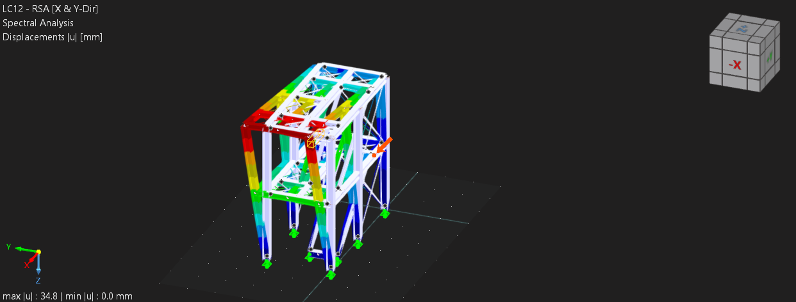

* **Maximum Rotation about the Y-Axis:** Torsional rotation about the vertical Y-axis reaches a maximum of **2.0 mrad**, located on **Member No. 5** at a distance of **0.000 m**.

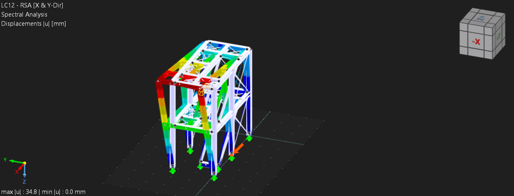

* **Maximum Rotation about the Z-Axis:** Torsional rotation about the vertical Z-axis reaches a maximum of **6.4 mrad**, located on **Member No. 462** at a distance of **1.125 m**.

The maximum stresses located at their corresponding critical cross-sections which follow from the Response Spectra Analysis are the following: 

### Ultimate Limit State (ULS) STR/GEO - Seismic Analysis Summary

The structural checks under seismic loading condition RC1 show that all examined members remain well within their material capacity limits. Below is the detailed breakdown for each critical check:

#### 1. Member 129 (Total Axial/Normal Stress)
* **Location:** 3.514 meters
* **Stress Point:** 1
* **Stress Type:** Total Normal Stress ($\sigma_{x,tot}$)
* **Existing Stress:** 155.792 N/mm²
* **Limit Stress:** 350.000 N/mm²
* **Status:** Safe. The stress ratio ($\eta$) is **0.445**, utilizing 44.5% of the total capacity.

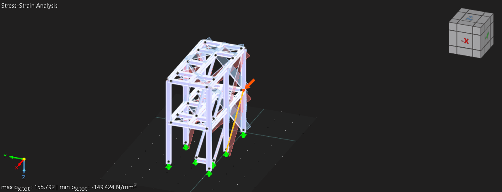

#### 2. Member 470 (Total Shear Stress)
* **Location:** 1.000 meter
* **Stress Point:** 11
* **Stress Type:** Total Shear Stress ($\tau_{tot}$)
* **Existing Stress:** -20.264 N/mm²
* **Limit Stress:** 202.073 N/mm²
* **Status:** Safe. The stress ratio ($\eta$) is **0.100**, utilizing 10.0% of the shear capacity.

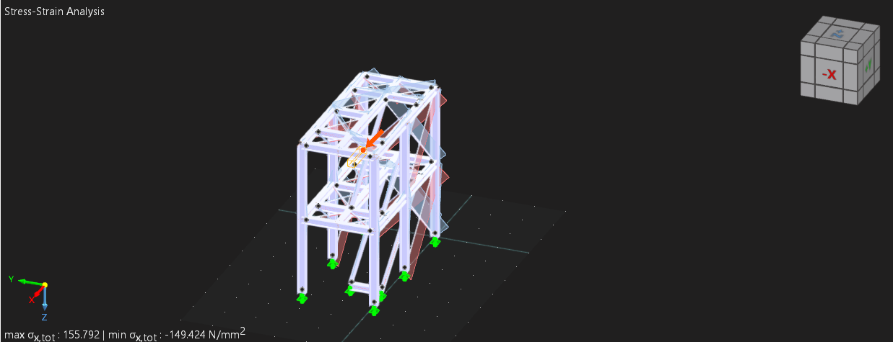

#### 3. Member 129 (Equivalent von Mises Stress)
* **Location:** 3.514 meters
* **Stress Point:** 1
* **Stress Type:** Equivalent von Mises Stress ($\sigma_{eqv, von Mises}$)
* **Existing Stress:** 155.792 N/mm²
* **Limit Stress:** 350.000 N/mm²
* **Status:** Safe. The stress ratio ($\eta$) is **0.445**, utilizing 44.5% of the allowable limit.

The modal combination rule used for the structural modes is chosen to be a Complete Quadratic Combination (CQC) by using equivalent linear combination. This choice was made based on the fact that some of the eigenmodes show to be very close to each other (see for example mode 2 and mode 3). When the eigenfrequencies of those certain modes differ by less than 10%, their modal responses are statistically dependent and can couple; the simple SRSS rule would unsafely ignore this interaction, whereas CQC correctly accounts for it via cross-modal correlation coefficients. For the different directions of the seismic input, it was chosen to make use of the Scaled Sum, with a factor of 100% / 30%, as it is the most realistic combination as well as a conservative approach, wihtout being as overly conservative as the absolute sum is, recommended by EN 1998-1. 

## Discrepancy between Response Spectrum analysis (Q5) and Time history analysis (Q4) results

1. Spectral Shape: The Broadened Envelope vs. The Specific Ground Motion

The primary driver of the conservative RSA results is the nature of the seismic input. The Eurocode design spectrum used in the RSA is an artificially broadened, smoothed envelope designed to account for a wide array of geological uncertainties. It features a sustained plateau of maximum spectral acceleration that spans a broad range of structural periods. Consequently, almost all significant modes of the structure are subjected to maximum or near-maximum inertial forces simultaneously.

Conversely, the THA relies on a specific, raw acceleration record (Set 4). While Set 4 was methodically selected because its narrow, jagged spectral peaks coincided reasonably  with the structure’s dominant natural periods ($T_x = 0.066$ s and $T_y = 0.21$ s), real earthquake records are highly irregular. The energy content of Set 4 drops off precipitously outside of these specific resonant spikes. The peak excites the dominant  fundamental periods intensely, but fails to deliver sustained energy across the broader frequency spectrum.

2. Modal Mass Participation 

The narrow bandwidth of the Set 4 ground motion exposes a critical limitation of the time history approach. The eigenvalue analysis demonstrated that the dominant fundamental modes (Mode 4 for the X-direction and Mode 1 for the Y-direction) only mobilize approximately 49.4% and 60.6% of the structure's effective modal mass respectively. The remaining 40% to 50% of the mass relies on the excitation of the other modes to contribute to the dynamic response. In the RSA procedure, 102 modes were explicitly combined to achieve the code-mandated >90% mass participation threshold. Because the Eurocode spectrum is broadly elevated, these higher-order modes were actively excited and contributed significantly to the cumulative base shear and global drift. In contrast, during the THA, the Set 4 ground motion lacked the necessary frequency content to excite these specific higher-order modes. As a result, nearly half of the structure's dynamic mass remained virtually unexcited during the time history simulation, leading to a drastically reduced global structural response.

3. Peak Concurrency vs. Statistical Combination

Finally, the mathematical combination of modal responses inherently renders the RSA more conservative. The RSA utilizes statistical combination rules (CQC used for Q5) which assume that the absolute peak responses of the individual modes occur simultaneously, yielding a theoretical upper-bound envelope of stresses. The THA calculates the response directly in the time domain, where the peak displacements of different modes occur at different fractions of a second. This lack of time-domain concurrency naturally prevents the structural deformations from stacking perfectly, further explaining the lower ultimate limit state (ULS) demands observed in the time history results.

The RSA provides a highly conservative, code-compliant upper bound for the structural design by artificially ensuring that over 90% of the modal mass is subjected to peak spectral demands. While the THA utilizing Set 4 accurately captures the true time-domain behavior of the dominant structural modes, its jagged spectral profile fails to excite the higher-order modes, rendering it an unconservative metric if used in isolation for evaluating the global structural capacity.

# Conclusion on the capacity of the structure

Seismic capacity is governed by lateral stiffness to prevent structural instability (P-Delta effects) and severe damage. The total height of the structure is H = 5.035 [m]. The maximum absolute deformation occurred at the roof level: Maximum Global Displacement ($\Delta_{max}$): 34.8 [mm]

The global drift ratio Global Design Drift Ratio is calculated as:$$Global Design Drift Ratio = \nu * \frac{\Delta_{max}}{H} = 0.5 * \frac{34.8 \text{ mm}}{5035 \text{ mm}} = 0.0035 \text{ rad} \approx \mathbf{0.35\%}$$A global drift ratio of 0.35% is well within standard acceptable limits for the ultimate limit state of steel frames under seismic loading (which typically allow drifts under 0.5% to ensure life safety and prevent collapse).

The Response Spectra analysis proves that the structure has sufficient seismic capacity. The substantial cross-sectional area of the HEB 240 columns ensures that internal stresses remain at roughly 44.5% of the S355 steel's yield threshold, while the overall frame stiffness restricts global deformations to a safe 0.35% drift ratio. Therefore, the building will comfortably survive the assigned bi-directional seismic event with no structural damage.  

# Q6

## a) Response spectrum analysis with elastic foundation support

The dynamic SSI effects were first approximated in RFEM by replacing the fixed base with a thick rigid foundation block supported by distributed elastic springs. This is a simplified RSA model: the structure is still analysed using the EC8 response spectrum, but the support is no longer perfectly fixed.

### Soil and Foundation Properties

The soil properties are taken from the Part 2 geotechnical investigation:

| Property | Value |
| --- | ---: |
| Shear-wave velocity $V_{s,30}$ | $160\ \mathrm{m/s}$ |
| Soil density $\rho$ | $1800\ \mathrm{kg/m^3}$ |
| Poisson ratio $\nu$ | $0.33$ |
| SPT value $N_{SPT}$ | $10$ blows per $0.3\ \mathrm{m}$ |
| Undrained shear strength $c_u$ | $50\ \mathrm{kPa}$ |

The shear modulus used for the elastic half-space is obtained from

$$
G = \rho V_s^2 = 1800(160)^2 = 46.08\ \mathrm{MPa}.
$$

The RFEM foundation block has a contact area

$$
A_b = 18.603\ \mathrm{m^2}.
$$

For use with the half-space formulas, this area is replaced by an equivalent square foundation,

$$
A_b = (2B)^2,
\qquad
B = \sqrt{\frac{A_b}{4}} = 2.157\ \mathrm{m},
$$

so the equivalent square side length is

$$
2B = 4.313\ \mathrm{m}.
$$

### Elastic Spring Stiffness

Using the SSI guideline formulas for a square surface foundation, the horizontal and vertical static stiffnesses are approximated as

$$
K_y = \frac{9GB}{2-\nu},
\qquad
K_z = \frac{4.54GB}{1-\nu}.
$$

The rocking stiffness about the horizontal axis is

$$
K_{rx} = \frac{3.6GB^3}{1-\nu}.
$$

Substitution gives:

| Stiffness | Value | Use in RFEM model |
| --- | ---: | --- |
| $K_x = K_y$ | $5.36\times10^8\ \mathrm{N/m}$ | global horizontal support stiffness |
| $K_z$ | $6.73\times10^8\ \mathrm{N/m}$ | vertical support stiffness |
| $K_{rx}=K_{ry}$ | $2.48\times10^9\ \mathrm{N\,m/rad}$ | equivalent rocking flexibility |

For a distributed surface support, the translational stiffnesses are divided by the contact area:

$$
k_x = k_y = \frac{K_y}{A_b}=28.79\ \mathrm{MN/m^3},
\qquad
k_z = \frac{K_z}{A_b}=36.20\ \mathrm{MN/m^3}.
$$

These values were used as the elastic foundation support stiffnesses. The rocking flexibility is not entered as an independent spring in the distributed-support model; it emerges from the deformation pattern of the spring-supported rigid foundation block.

### RSA Results with Foundation Springs

The response spectrum analysis with the elastic foundation support gave the following maximum deformations:

| Response quantity | Value | Location |
| --- | ---: | --- |
| Maximum displacement in $X$ | $1.5\ \mathrm{mm}$ | Member 30, $x=2.470\ \mathrm{m}$ |
| Maximum displacement in $Y$ | $23.8\ \mathrm{mm}$ | Member 230, $x=1.150\ \mathrm{m}$ |
| Maximum displacement in $Z$ | $3.1\ \mathrm{mm}$ | FE node 186, $(-0.680,\ 2.613,\ 0.000)\ \mathrm{m}$ |
| Maximum vectorial displacement | $23.9\ \mathrm{mm}$ | Member 28, $x=2.470\ \mathrm{m}$ |
| Maximum rotation about $X$ | $5.1\ \mathrm{mrad}$ | Member 27, $x=0.741\ \mathrm{m}$ |
| Maximum rotation about $Y$ | $0.8\ \mathrm{mrad}$ | Member 193, $x=0.214\ \mathrm{m}$ |
| Maximum rotation about $Z$ | $1.7\ \mathrm{mrad}$ | Member 462, $x=0.643\ \mathrm{m}$ |

The governing displacement remains the lateral displacement in the global $Y$ direction. This is consistent with the modal basis used earlier, where the dominant horizontal mode also acted mainly in the global $Y$ direction.

### Comparison with the Fixed-Base RSA of Q5

Compared with the fixed-base RSA results of Q5, the elastic-foundation model gives:

| Response quantity | Fixed-base Q5 | Elastic foundation Q6a | Change |
| --- | ---: | ---: | ---: |
| Maximum displacement in $X$ | $6.5\ \mathrm{mm}$ | $1.5\ \mathrm{mm}$ | $-77\%$ |
| Maximum displacement in $Y$ | $34.2\ \mathrm{mm}$ | $23.8\ \mathrm{mm}$ | $-30\%$ |
| Maximum displacement in $Z$ | $3.7\ \mathrm{mm}$ | $3.1\ \mathrm{mm}$ | $-16\%$ |
| Maximum vectorial displacement | $34.8\ \mathrm{mm}$ | $23.9\ \mathrm{mm}$ | $-31\%$ |
| Maximum rotation about $X$ | $22.5\ \mathrm{mrad}$ | $5.1\ \mathrm{mrad}$ | $-77\%$ |
| Maximum rotation about $Y$ | $2.0\ \mathrm{mrad}$ | $0.8\ \mathrm{mrad}$ | $-60\%$ |
| Maximum rotation about $Z$ | $6.4\ \mathrm{mrad}$ | $1.7\ \mathrm{mrad}$ | $-73\%$ |

The RFEM RSA result with elastic foundation support gives smaller maximum deformations than the fixed-base result from Q5. The maximum displayed global $Y$ displacement decreases from $34.2\ \mathrm{mm}$ to $23.8\ \mathrm{mm}$, and the maximum vectorial displacement decreases from $34.8\ \mathrm{mm}$ to $23.9\ \mathrm{mm}$.

This reduction should not be interpreted as a general rule that SSI always reduces response. It is a result of this particular response-spectrum model. Changing the support condition changes the modal periods, modal participation factors, and the spectral ordinates sampled by the modes. The distributed spring-supported foundation therefore modifies the modal combination, which in this case leads to lower peak RSA displacements and rotations.

## b) Frequency-domain generalized SDOF analysis

The second SSI assessment is performed in the frequency domain. The purpose is not to repeat the full RFEM response spectrum analysis, but to compare the fixed-base response with an equivalent generalized SDOF model that includes dynamic soil-foundation interaction.

### Step 1: Generalized SDOF Reduction

The structural part is reduced to the dominant RFEM mode in the major horizontal direction. The generalized displacement coordinate is denoted by $q(t)$, so the lateral displacement of a point at height $z_j$ is approximated as

$$
u_j(t) \approx \psi_j q(t).
$$

The RFEM modal data used for the reduced model are:

| Quantity | Value |
| --- | ---: |
| First-mode frequency $f_1$ | $6.20\ \mathrm{Hz}$ |
| Circular frequency $\omega_1$ | $38.956\ \mathrm{rad/s}$ |
| Generalized mass $m^\ast$ | $2422.5\ \mathrm{kg}$ |
| Effective modal mass in $Y$ | $8063.7\ \mathrm{kg}$ |
| Generalized load factor $L$ | $4419.8\ \mathrm{kg}$ |
| Generalized stiffness $k^\ast=m^\ast\omega_1^2$ | $3.676\times10^6\ \mathrm{N/m}$ |
| Damping ratio $\xi$ | $5\%$ |
| Generalized damping $c^\ast=2\xi\omega_1m^\ast$ | $9.437\times10^3\ \mathrm{Ns/m}$ |

The first-mode ordinates were obtained by averaging the normalized RFEM $u_Y$ displacements over all mesh nodes at each level. This is preferable to using a single reference node because the frame does not behave as a rigid diaphragm and the modal displacement varies across each level.

| Level | Height $z$ [m] | Normalized displacement $\psi$ |
| --- | ---: | ---: |
| 1 | $2.47$ | $0.42672$ |
| 2 | $4.94$ | $0.65253$ |

*Figure 1. First RFEM mode shape used to recover the response at the two levels. The markers show the level-averaged modal ordinates, while the horizontal bars show the range of mesh-node values at each level.*

The ideal input for this calculation would be a complete RFEM nodal mass export: a table listing each relevant mass node, its lumped translational mass, its height coordinate, and its mode-1 displacement ordinate. With that information, the generalized quantities could be computed directly by summing over all nodes. Since only the mode-shape ordinates were available, the missing mass moments were estimated using a two-level surrogate. The two unknown level masses were fitted such that the known generalized mass $m^\ast$ and generalized load factor $L$ are reproduced:

$$
m^\ast = m_1\psi_1^2 + m_2\psi_2^2,
\qquad
L = m_1\psi_1 + m_2\psi_2.
$$

This gives:

| Quantity | Value |
| --- | ---: |
| $m_1$ at level 1 | $4789.7\ \mathrm{kg}$ |
| $m_2$ at level 2 | $3641.0\ \mathrm{kg}$ |
| $H$ | $16785.3\ \mathrm{kg\,m}$ |
| $M_r$ | $54939.8\ \mathrm{kg}$ |
| $S$ | $53071.9\ \mathrm{kg\,m}$ |
| $J$ | $205679.8\ \mathrm{kg\,m^2}$ |

This approximation is acceptable for the present frequency-domain comparison because it preserves the modal mass and modal participation of the dominant mode. A more refined model would replace this surrogate with the full RFEM nodal mass distribution.

### Step 2: Soil Dynamic Stiffness

The soil is modeled as a homogeneous half-space. The properties are taken from the Part 2 geotechnical investigation:

| Property | Value |
| --- | ---: |
| Shear-wave velocity $V_s$ | $160\ \mathrm{m/s}$ |
| Soil density $\rho$ | $1800\ \mathrm{kg/m^3}$ |
| Poisson ratio $\nu$ | $0.33$ |

The corresponding shear modulus is

$$
G = \rho V_s^2 = 46.08\ \mathrm{MPa}.
$$

The RFEM foundation contact area is converted to an equivalent square foundation:

$$
A_b = 18.603\ \mathrm{m^2},
\qquad
B = \sqrt{\frac{A_b}{4}}=2.157\ \mathrm{m}.
$$

For a square surface foundation, the static horizontal and rocking stiffnesses are

$$
K_y=\frac{9GB}{2-\nu},
\qquad
K_{rx}=\frac{3.6GB^3}{1-\nu}.
$$

Numerically,

$$
K_y = 5.355\times 10^8\ \mathrm{N/m},
\qquad
K_{rx}=2.483\times 10^9\ \mathrm{N\,m/rad}.
$$

The dynamic stiffness terms are written as

$$
\tilde{k}_{yy}(\omega)=K_y + i\omega C_y,
$$

$$
\tilde{k}_{\theta\theta}(\omega)=K_{rx}(1-0.20a_0)+i\omega C_{rx},
\qquad
a_0=\frac{\omega B}{V_s}.
$$

The radiation dashpots are estimated from the dimensional forms in the SSI guideline:

$$
C_y \approx \rho V_s A_b,
\qquad
C_{rx} \approx \rho V_p I_{bx}.
$$

The chart multipliers were taken as 1.0 because the SSI charts were not digitized. This gives:

| Quantity | Value |
| --- | ---: |
| $C_y$ | $5.358\times10^6\ \mathrm{Ns/m}$ |
| $C_{rx}$ | $1.649\times10^7\ \mathrm{Nms/rad}$ |

The coupling terms $\tilde{k}_{y\theta}$ and $\tilde{k}_{\theta y}$ are neglected because the equivalent square foundation is assumed centered and symmetric.

### Step 3: Coupled Frequency-Domain Equations

The unknown frequency-domain coordinates are

$$
\mathbf{X}(\omega)=
\begin{bmatrix}
Q(\omega)\\
U_l(\omega)\\
\Theta_l(\omega)
\end{bmatrix},
$$

where:

- $Q(\omega)$ is the generalized structural deformation.
- $U_l(\omega)$ is the additional horizontal foundation translation caused by SSI.
- $\Theta_l(\omega)$ is the additional rocking rotation caused by SSI.

Following the lecture notation, the free-field ground acceleration is the known input. The reference peak ground acceleration from Q3 is

$$
a_{gR}=(0.35+0.01C)g=(0.35+0.01)g=0.36g.
$$

For importance class IV, the importance factor is

$$
\gamma_I=1.4.
$$

Therefore, the design acceleration used in the notebook is

$$
\tilde{a}_g = \gamma_I a_{gR}=1.4(0.36g)=0.504g = 4.944\ \mathrm{m/s^2}.
$$

The coupled system is

$$
\left[
\begin{array}{ccc}
k^\ast+i\omega c^\ast-\omega^2m^\ast & -\omega^2L & -\omega^2H\\
-\omega^2L & \tilde{k}_{yy}-\omega^2M_r & \tilde{k}_{y\theta}-\omega^2S\\
-\omega^2H & \tilde{k}_{\theta y}-\omega^2S & \tilde{k}_{\theta\theta}-\omega^2J
\end{array}
\right]
\mathbf{X}
=
-\tilde{a}_g
\begin{bmatrix}
L\\
M_r\\
S
\end{bmatrix}.
$$

This is the generalized form of the lecture equations. The top equation is the equilibrium of the structural generalized mass, while the second and third equations are the horizontal force and rocking moment balances at the soil-foundation interface.

### Step 4: Fixed-Base Reference Case

To isolate the effect of SSI, the same generalized SDOF model is also solved without foundation flexibility:

$$
\left(k^\ast+i\omega c^\ast-\omega^2m^\ast\right)Q_{fb}
=
-L\tilde{a}_g.
$$

This comparison is important because it keeps the structural reduction and input motion identical. The only difference is whether the soil-foundation degrees of freedom $U_l$ and $\Theta_l$ are included.

### Step 5: Response Recovery

Once $Q$, $U_l$, and $\Theta_l$ are known, the relative displacement at a reference height is recovered as

$$
U_{\mathrm{rel},j}(\omega)
=
\psi_jQ(\omega)+U_l(\omega)+z_j\Theta_l(\omega).
$$

The absolute displacement also includes the free-field ground displacement,

$$
U_{\mathrm{abs},j}(\omega)
=
U_g(\omega)+U_{\mathrm{rel},j}(\omega),
\qquad
U_g(\omega)=-\frac{\tilde{a}_g}{\omega^2}.
$$

The absolute acceleration is then

$$
A_{\mathrm{abs},j}(\omega)
=
-\omega^2U_{\mathrm{abs},j}(\omega).
$$

### Step 6: Results

The dynamic stiffness and displacement response obtained from the notebook are shown in Figure 2.

*Figure 2. Dynamic soil stiffness terms and level 2 displacement response.*

The displacement response for the Q3 design PGA is shown separately in Figure 3.

*Figure 3. Displacement response at the two levels for $a_g=0.504g$.*

The corresponding acceleration amplification is shown in Figure 4.

*Figure 4. Absolute acceleration amplification for the fixed-base and SSI generalized SDOF models.*

The numerical peak response at level 2 is:

| Quantity | Fixed-base model | SSI model |
| --- | ---: | ---: |
| Peak acceleration amplification $\lvert a_{\mathrm{abs}}/a_g\rvert$ | $11.954$ | $12.095$ |
| Frequency at acceleration peak | $6.190\ \mathrm{Hz}$ | $5.881\ \mathrm{Hz}$ |
| Maximum relative displacement amplitude | $38.832\ \mathrm{mm}$ | $43.693\ \mathrm{mm}$ |

### Interpretation

The SSI model shifts the peak response from approximately $6.19\ \mathrm{Hz}$ to $5.88\ \mathrm{Hz}$. This reduction in frequency is physically expected because foundation translation and rocking add flexibility to the system. The response is therefore slightly softer than the fixed-base model.

The maximum relative displacement increases from $38.8\ \mathrm{mm}$ to $43.7\ \mathrm{mm}$, which is an increase of about $12.5\%$. The acceleration amplification remains close to the fixed-base value, increasing only from $11.954$ to $12.095$. This indicates that, for the assumed foundation size and soil properties, SSI has a clearer effect on displacement and resonant frequency than on the peak acceleration amplification.

The frequency-domain result should not be compared one-to-one with the RFEM RSA displacement from part (a), because part (a) is a multimodal response-spectrum result while part (b) is a single generalized SDOF frequency sweep. The useful comparison is qualitative: both calculations show that SSI changes the dynamic characteristics of the system. In the generalized SDOF model this appears as a lower resonant frequency and a larger modal displacement amplitude; in the RFEM RSA model it appears as a changed deformation pattern with lower displayed peak deformation values for the selected response-spectrum case.

The main limitations are the two-level mass surrogate and the approximate SSI radiation coefficients. A more refined calculation would use the full RFEM nodal mass export and digitized chart values for $k_y(a_0)$, $C_y(a_0)$, and $C_{rx}(a_0)$.

