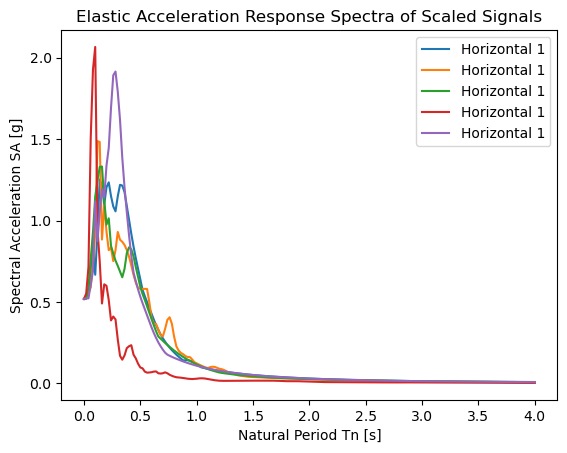
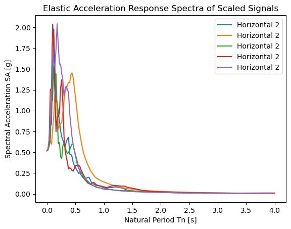
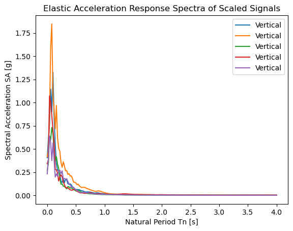
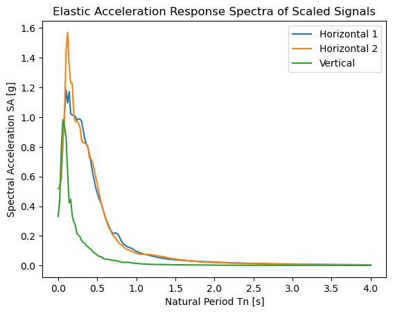

**1) As part of the team of specialists, you are asked to use five sets of tri-axial ground
motions provided and derive the motions in the three principal directions. For each
tri-axial set of recordings decompose the two horizontal (as recorded) components
in the principal directions and consider the vertical component acting along the
third principal direction. Scale the derived horizontal ones such that the peak
ground acceleration (PGA) has a value of $PGA_{hor} = a_{g,R} \cdot \gamma_I$. Scale the vertical
component according to the instructions in the Python file distributed.
You are asked to:
a) Plot the elastic acceleration response spectra of the scaled signals as defined
above along each principal direction for a damping ratio of $\xi = 0.04C$ and for
periods between $T = 0.00$ sec and $T = 4.00$ sec.
b) Derive the elastic response spectra (ERS) in the three principal directions
corresponding to the mean value of the elastic spectra defined in question (1a).
Explain the differences between the obtained ERS (mean value) and the ones
of EN1998-1 (scaled to the same PGA).2**

Given the characteristics of the structural system, which is classified to be of importance class IV. Accordign to the EN1998-1 guidelines, $\gamma_I$ takes a value of 1.4. The acceleration of the ground is equal to 0.37$m/s^2$, which results in a PGA of 0.518$m/s^2$. Using a damping of 4.2%, gives the following elastic acceleration spectra of the scaled signals along each principal direction:

- First horizontal direction

- Second horizontal direction

- Vertical direction

Taking the average of the sets for each direction, gives the elastic response spectra for each.

**EXPLAIN DIFFERENCE WITH THE ONE IN THE EUROCODE.

**2) The design team is interested in the inelastic response spectra:
a) Derive the $R_y - \mu - T$ relationship, based on the Newmark and Hall (1982)
formulation for ductility equal to $\mu = \max\{1.7D; 1.7F\}$ . Plot the inelastic
acceleration response spectra for the $R_y - \mu - T$ relationship above, using
the mean ERS as computed along the two principal horizontal directions in
question (1b).
b) Derive the exact constant ductility inelastic acceleration response spectra, for
ductility equal to $\mu = \max\{1.7D; 1.7F\}$, of the five signals in question (1) when
decomposed along the two principal (horizontal) directions, and compute the
mean inelastic acceleration response spectra. Compare these with the ones
derived by using the simplified $R_y - \mu - T$ relationship of Newmark-Hall
(1982). What differences do you observe and why?**

Computing the inelastic acceleration response spectra for the $R_y - \mu - T$ relationship based on Newmark and Hall, using the mean ERS along the two principal horizontal directions, gives the following spectra:

Computing the constant ductility inelastic acceleration response spectra of the five signals in question when
decomposed along the two principal horizontal directions, gives the following spectra:

**EXPLAIN DIFFERENCES