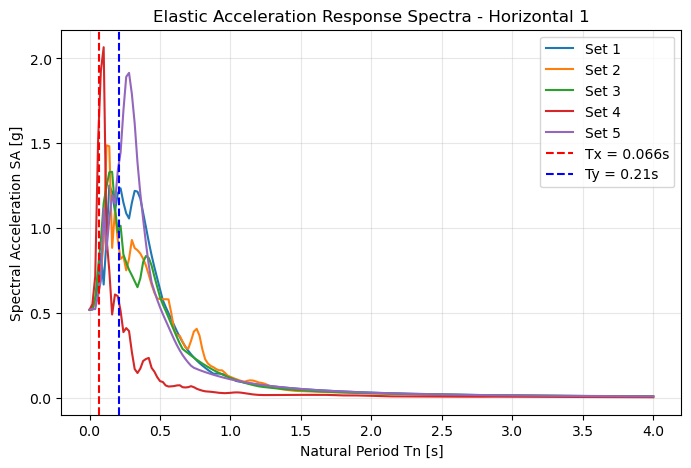
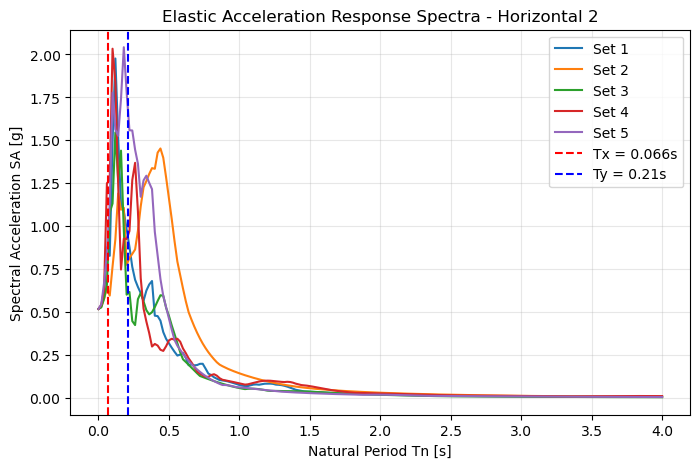
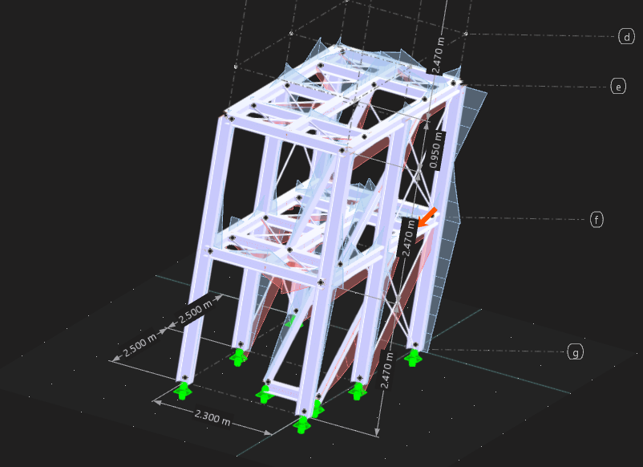

4) Perform a dynamic time history analysis with one set of input accelerations derived in question (1) along the principal directions. You are free to choose any set of triaxial motions (from the list provided) as well as the directions in which you apply the motions in the horizontal plane. Please report the following:
a) Substantiate your choice as to directions in which you apply the horizontal components of the ground excitation. You are not asked to perform multiple seismic analysis here but simply to explain your choice.

A computational routine was developed to construct the Elastic Response Spectra (ERS) for each principal direction of the unscaled ground motions. The algorithm applies a peak ground acceleration (PGA) scaling factor in accordance with the target design spectrum, defined by a structural damping ratio of 4.2%. The time-domain signals were converted into the frequency domain using numerical integration, yielding the Spectral Acceleration ($SA$) as a function of the natural period ($T_n$). This allows for a direct comparison between the energy demands of the earthquakes and the resonant frequencies of the structure.

The response spectra of the 5 scaled acceleration signals along principal directions are derived in ERS.ipynb. From which we can observe that the response spectra is almost identical for Horizontal 1 and Horizontal 2, and all 5 sets show a peak between a natural period of roughly 0.3~0.5 [s]. 

After conducting modal analysis of our selected structure in RFEM6, we get natural frequencies for the first 20 modes, and their corresponding modal effective modal masses: 
| Mode No. | Eigenvalue λ [1/s2] | Angular Frequency ω [rad/s] | Natural Frequency f [Hz] | Natural Period T [s] |
| :--- | :--- | :--- | :--- | :--- |
| 1 | 898.775 | 29.980 | 4.771 | 0.210 |
| 2 | 5761.336 | 75.903 | 12.080 | 0.083 |
| 3 | 5785.167 | 76.060 | 12.105 | 0.083 |
| 4 | 9005.584 | 94.898 | 15.103 | 0.066 |
| 5 | 10077.998 | 100.389 | 15.977 | 0.063 |
| 6 | 13377.216 | 115.660 | 18.408 | 0.054 |
| 7 | 13715.399 | 117.113 | 18.639 | 0.054 |
| 8 | 15598.965 | 124.896 | 19.878 | 0.050 |
| 9 | 21885.597 | 147.938 | 23.545 | 0.042 |
| 10 | 21888.438 | 147.947 | 23.547 | 0.042 |
| 11 | 21943.938 | 148.135 | 23.576 | 0.042 |
| 12 | 26491.293 | 162.761 | 25.904 | 0.039 |
| 13 | 26528.471 | 162.876 | 25.922 | 0.039 |
| 14 | 26536.380 | 162.900 | 25.926 | 0.039 |
| 15 | 26540.139 | 162.911 | 25.928 | 0.039 |
| 16 | 26542.579 | 162.919 | 25.929 | 0.039 |
| 17 | 26561.188 | 162.976 | 25.938 | 0.039 |
| 18 | 35432.434 | 188.235 | 29.959 | 0.033 |
| 19 | 35815.411 | 189.250 | 30.120 | 0.033 |
| 20 | 46175.032 | 214.884 | 34.200 | 0.029 |

| Mode No. | Mi [kg] | meX | meY | meZ | fmeX | fmeY | fmeZ |
| :--- | :--- | :--- | :--- | :--- | :--- | :--- | :--- |
| 1 | 1092.0 | 2.6 | 3278.3 | 0.4 | 0.000 | 0.606 | 0.000 |
| 2 | 117.8 | 5.5 | 100.7 | 0.4 | 0.001 | 0.019 | 0.000 |
| 3 | 109.6 | 0.0 | 0.1 | 0.0 | 0.000 | 0.000 | 0.000 |
| 4 | 1194.3 | 2672.1 | 374.3 | 147.7 | 0.494 | 0.069 | 0.027 |
| 5 | 1285.6 | 1172.3 | 730.6 | 60.1 | 0.217 | 0.135 | 0.011 |
| 6 | 78.7 | 2.3 | 0.5 | 0.0 | 0.000 | 0.000 | 0.000 |
| 7 | 83.5 | 0.1 | 0.3 | 5.3 | 0.000 | 0.000 | 0.001 |
| 8 | 247.0 | 653.8 | 0.1 | 515.4 | 0.121 | 0.000 | 0.095 |
| 9 | 20647274.8 | 0.0 | 0.0 | 0.0 | 0.000 | 0.000 | 0.000 |
| 10 | 3507897.2 | 0.0 | 0.0 | 0.1 | 0.000 | 0.000 | 0.000 |
| 11 | 23215.5 | 2.1 | 0.0 | 6.8 | 0.000 | 0.000 | 0.001 |
| 12 | 509090.4 | 0.0 | 0.4 | 0.0 | 0.000 | 0.000 | 0.000 |
| 13 | 1200495.8 | 0.0 | 0.3 | 0.0 | 0.000 | 0.000 | 0.000 |
| 14 | 2438040.6 | 0.0 | 0.1 | 0.0 | 0.000 | 0.000 | 0.000 |
| 15 | 2685648.4 | 0.0 | 0.1 | 0.0 | 0.000 | 0.000 | 0.000 |
| 16 | 3768861.5 | 0.0 | 0.0 | 0.0 | 0.000 | 0.000 | 0.000 |
| 17 | 2156375.0 | 0.0 | 0.2 | 0.0 | 0.000 | 0.000 | 0.000 |
| 18 | 90002.0 | 0.0 | 7.4 | 0.0 | 0.000 | 0.001 | 0.000 |
| 19 | 1641.5 | 0.2 | 394.4 | 0.5 | 0.000 | 0.073 | 0.000 |
| 20 | 13617.6 | 0.0 | 0.1 | 0.7 | 0.000 | 0.000 | 0.000 |
| Σ | 37046368.9 | 4511.3 | 4888.0 | 737.3 | 0.834 | 0.904 | 0.136 |
| ΣM | | 5408.2 | 5408.2 | 5408.2 | | | |
| % | | 83.42 | 90.38 | 13.63 | | | |

From which we can see that the x-axis is governed by mode 4 (effective modal mass factor 0.494) and the y-axis by mode 1 (effective modal mass factor 0.606), according to the dominant modal mass contribution compared to the other modes. Mode 4, governing for the x-axis has a fundamental period of 0.066[s] and an effective modal mass of 1194.3[kg]. Mode 1, governing for the y-axis has a fundamental period of 0.21[s] and an effective modal mass of 1092[kg]. 

We set these two fundamental periods into the derived response spectra. 

The structural frame exhibits governing natural periods of Tx = 0.066 s for the X-direction and Ty = 0.21 s for the Y-direction. Because both principal axes are mechanically stiff, they fall directly within the high-acceleration plateau (the resonant peak zones) of standard seismic response spectra. Rather than dissipating energy through large physical displacements, the structure is highly vulnerable to attracting massive inertial forces during a seismic event.

To perform a rigorous Ultimate Limit State (ULS) capacity check, the structure must be evaluated against the ground motion that produces the most severe concurrent internal stresses. An algorithmic search of the provided response spectra identified Set 4 as the absolute worst-case scenario due to a critical dual-resonance phenomenon:

CRITICAL EXCITATION SEARCH RESULTS:

Target Period for X-direction: Tx = 0.066 s

Target Period for Y-direction: Ty = 0.21 s
- The most critical excitation is Set 4
- Align Horizontal 1 to X-axis, Horizontal 2 to Y-axis
- Resulting SA at Tx = 1.504 g
- Resulting SA at Ty = 0.925 g
- Total Combined SA Demand = 2.429 g

X-Axis Maximization (Horizontal 1): The primary horizontal component of Set 4 contains immense high-frequency energy, featuring a sharp spectral acceleration peak precisely in the ultra-short period range. Aligning this component with the structure's X-axis (Tx = 0.066 s) forces the stiffest lateral system to absorb an extreme peak spectral acceleration of 1.504 g. This direct resonance guarantees the maximum possible base shear and overturning moments in the X-direction.

Y-Axis Maximization (Horizontal 2): Concurrently, the orthogonal component of Set 4 (Horizontal 2) exhibits a distinct spectral peak that crests precisely across the 0.20 to 0.30 s range. By aligning this specific excitation component with the Y-axis (Ty = 0.21 s), the orthogonal structural system is hit with near-peak acceleration demands at the exact same moment the X-axis is maximized.

b) Determine the maximum displacements and stresses as well as their critical locations and explain why the chosen locations are considered critical.

The time history analysis was conducted with the two horizontal excitations inputted accordingly into the corresponding x and y axes in an accelerogram. Implementing the linear modal analysis rather than linear implicit Neumark to save computational time. The time step was 0.01[s] with split saved time steps of 10. 

The maximum displacement resulting from the time history analysis are as follows: 
| Description | Value | Unit | Notes |
| :--- | :--- | :--- | :--- |
| Maximum displacement in X-direction | 2.8 | mm | Member No. 222, x: 1.000 m |
| Maximum displacement in Y-direction | -11.2 | mm | Member No. 27, x: 2.470 m |
| Maximum displacement in Z-direction | -1.1 | mm | Member No. 218, x: 3.886 m |
| Maximum vectorial displacement | 11.5 | mm | Member No. 27, x: 2.470 m |
| Maximum rotation about X-axis | -6.6 | mrad | Member No. 476, x: 0.170 m |
| Maximum rotation about Y-axis | -0.8 | mrad | Member No. 1, x: 0.000 m |
| Maximum rotation about Z-axis | 2.3 | mrad | Member No. 220, x: 3.886 m |

The maximum deformation for both X and Y were observed at the roof members. This makes sense because structural deflections compound upward. The free end of the global cantilever experiences the summation of the inter-story drifts from all lower levels, resulting in maximum absolute displacement at the highest elevation.

Although the structure was subjected to extreme spectral acceleration along its X-axis ($T_x = 0.066 \text{ s}$) and relatively low acceleration along its Y-axis ($T_y = 0.21 \text{ s}$), the recorded displacement in the Y-direction was approximately four times larger than in the X-direction. 

The relationship between Spectral Acceleration ($SA$) and Spectral Displacement ($SD$) is strictly period-dependent, defined by the formula:

$$SD = SA \cdot \frac{T^2}{4\pi^2}$$

This mathematical relationship demonstrates that displacement demand grows exponentially with the structural period. Calculating the displacement multipliers for both axes yields: 

X-Axis: $\frac{0.066^2}{4\pi^2} \approx 0.00011$

Y-Axis: $\frac{0.210^2}{4\pi^2} \approx 0.00111$

The fundamental flexibility of the Y-axis gives it a theoretical displacement sensitivity roughly 10 times greater than the X-axis. Therefore, even though the Y-axis was subjected to a significantly lower inertial force, its lack of stiffness allowed it to undergo massive physical deformations. The X-axis acted as a rigid block—attracting massive base shear and stress but resisting deformation—while the Y-axis acted as a flexible rod, shedding stress but experiencing extreme drift.

On the other hand, the maximum internal forces are summarized as follows : 
|  Member No. | Location x [m] | Stress Point No. | Loading No. | Stress Type | Existing Stress [N/mm²] | Limit Stress [N/mm²] | Stress Ratio η [--] |
 | :--- | :--- | :--- | :--- | :--- | :--- | :--- | :--- |
442 | 0.980 | 21 | CO91 | σx,tot | 13.303 | 350.000 | 0.038 |
 476 | 0.170 | 11 | CO91 | τtot | -8.519 | 202.073 | 0.042 |
 476 | 0.170 | 11 | CO91 | σeqv,von Mises | 14.757 | 350.000 | 0.042 |

The time history analysis reveals that the critical internal stresses are heavily concentrated at the base of the lowest-story columns. As evidenced in the visual below, the maximum axial, shear, and von mises stresses all occur on the first floor of the structure. 

Under global lateral excitation, the multi-story frame behaves macroscopically as a vertical cantilever. The inertial forces generated by the mass of each floor level accumulate downwards through the load path. Consequently, the base columns must resist the maximum global base shear. Furthermore, the lateral sway of the upper stories generates a massive global overturning moment. As the building oscillates, the exterior columns parallel to the direction of motion experience alternating cycles of extreme axial compression and tension, coupled with maximum bending stress. This combined stress state makes the foundation-level boundary elements the most critical components for seismic capacity.

c) Conclude as to the seismic capacity of the structure.

To determine the final seismic capacity of the structure, the maximum dynamic demands (internal forces and global displacements) obtained from the time history analysis must be evaluated against the mechanical resistance of the frame. The structure is composed of HEB 240 cross-sections utilizing S355 structural steel.

RFEM calculates the unity check value of the maximum stresses against the maximum resistance of the specific member. It is evident that the unity check is satisfactory with a value of 0.038, 0.042, and 0.042 respectively for axial, shear, and von mises stresses. 

Seismic capacity is also governed by lateral stiffness to prevent structural instability (P-Delta effects) and severe damage. The total height of the structure is H = 4.94 [m].The maximum absolute deformation occurred at the roof level in the flexible Y-direction:Max Global Displacement ($\Delta_{max}$): 11.5[mm]

The global drift ratio ($\theta$) is calculated as:$$\theta = \frac{\Delta_{max}}{H} = \frac{11.5 \text{ mm}}{4940\text{ mm}} = 0.00233 \text{ rad} \approx \mathbf{0.23\%}$$A global drift ratio of 0.23% is well within standard acceptable limits for the ultimate limit state of steel frames under seismic loading (which typically allow drifts under 0.5% to ensure life safety and prevent collapse).

The dynamic time history analysis proves that the structure has sufficient seismic capacity. The substantial cross-sectional area of the HEB 240 columns ensures that internal stresses remain at roughly 4% of the S355 steel's yield threshold, while the overall frame stiffness restricts global deformations to a safe 0.23% drift ratio. Therefore, the building will comfortably survive the assigned bi-directional seismic event with no structural damage.

A comparative review of the global structural demands reveals a substantial discrepancy between the results of the Response Spectrum Analysis (Q5) and the linear Time History Analysis (Q4). The global displacements and internal stresses derived from the RSA significantly exceed those obtained from the THA—with the maximum RSA displacement in the Y-direction (34.2 mm) nearly tripling the corresponding THA displacement (11.5 mm). The remainder of this report is dedicated to justifying the reasoning behind the disrepancy between the results of RSA and THA.

-------------------------------------
Disrepancy between Response Spectrum analysis (Q5) and Time history analysis (Q4) results
-----------------------------------------

1. Spectral Shape: The Broadened Envelope vs. The Specific Ground Motion

The primary driver of the conservative RSA results is the nature of the seismic input. The Eurocode design spectrum used in the RSA is an artificially broadened, smoothed envelope designed to account for a wide array of geological uncertainties. It features a sustained plateau of maximum spectral acceleration that spans a broad range of structural periods. Consequently, almost all significant modes of the structure are subjected to maximum or near-maximum inertial forces simultaneously.

Conversely, the THA relies on a specific, raw acceleration record (Set 4). While Set 4 was methodically selected because its narrow, jagged spectral peaks coincided reasonably  with the structure’s dominant natural periods ($T_x = 0.066$ s and $T_y = 0.21$ s), real earthquake records are highly irregular. The energy content of Set 4 drops off precipitously outside of these specific resonant spikes. The peak excites the dominant  fundamental periods intensely, but fails to deliver sustained energy across the broader frequency spectrum.

2. Modal Mass Participation 

The narrow bandwidth of the Set 4 ground motion exposes a critical limitation of the time history approach. The eigenvalue analysis demonstrated that the dominant fundamental modes (Mode 4 for the X-direction and Mode 1 for the Y-direction) only mobilize approximately 49.4% and 60.6% of the structure's effective modal mass respectively. The remaining 40% to 50% of the mass relies on the excitation of the other modes to contribute to the dynamic response. In the RSA procedure, 102 modes were explicitly combined to achieve the code-mandated >90% mass participation threshold. Because the Eurocode spectrum is broadly elevated, these higher-order modes were actively excited and contributed significantly to the cumulative base shear and global drift. In contrast, during the THA, the Set 4 ground motion lacked the necessary frequency content to excite these specific higher-order modes. As a result, nearly half of the structure's dynamic mass remained virtually unexcited during the time history simulation, leading to a drastically reduced global structural response.

3. Peak Concurrency vs. Statistical Combination

Finally, the mathematical combination of modal responses inherently renders the RSA more conservative. The RSA utilizes statistical combination rules (CQC used for Q5) which assume that the absolute peak responses of the individual modes occur simultaneously, yielding a theoretical upper-bound envelope of stresses. The THA calculates the response directly in the time domain, where the peak displacements of different modes occur at different fractions of a second. This lack of time-domain concurrency naturally prevents the structural deformations from stacking perfectly, further explaining the lower ultimate limit state (ULS) demands observed in the time history results.

The RSA provides a highly conservative, code-compliant upper bound for the structural design by artificially ensuring that over 90% of the modal mass is subjected to peak spectral demands. While the THA utilizing Set 4 accurately captures the true time-domain behavior of the dominant structural modes, its jagged spectral profile fails to excite the higher-order modes, rendering it an unconservative metric if used in isolation for evaluating the global structural capacity.
