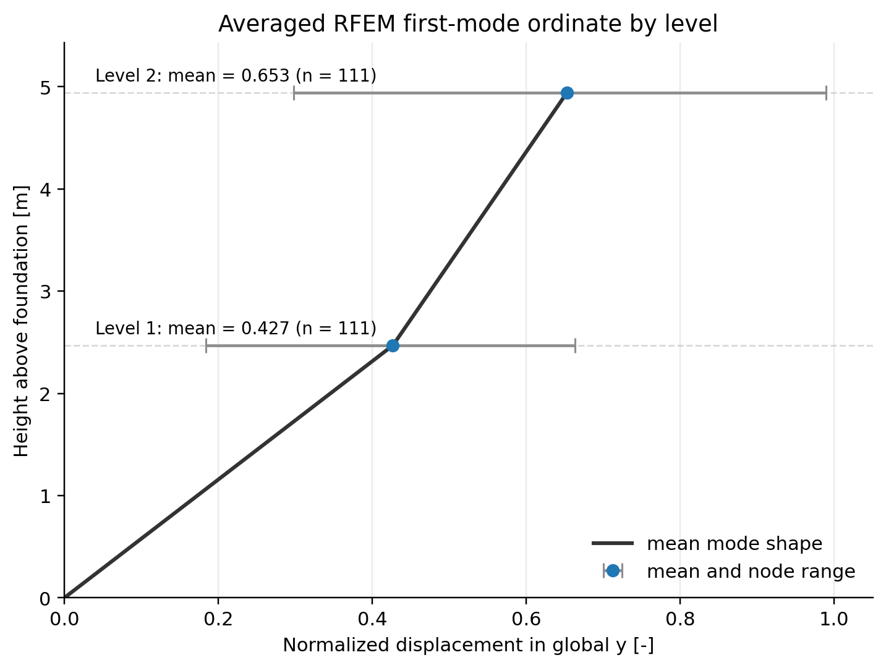
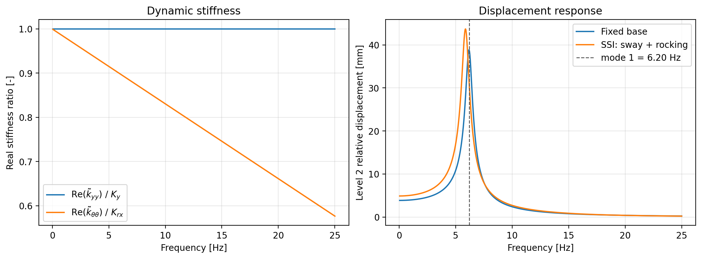
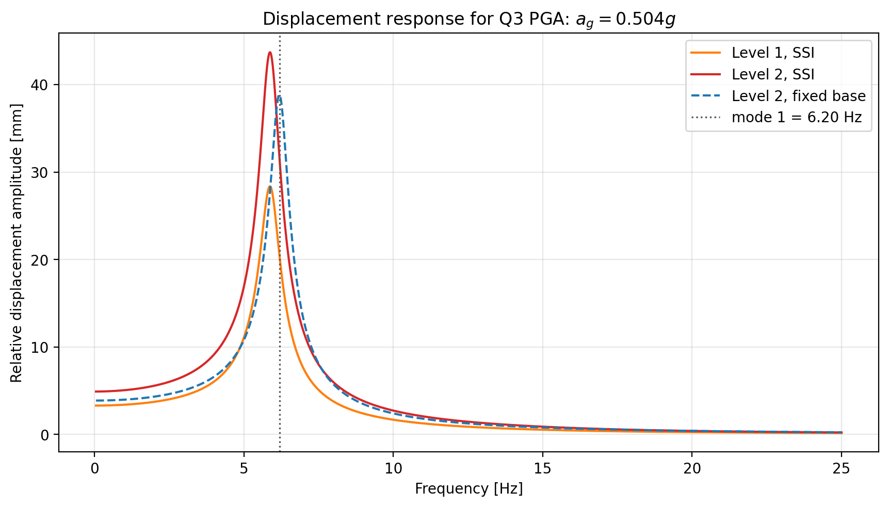
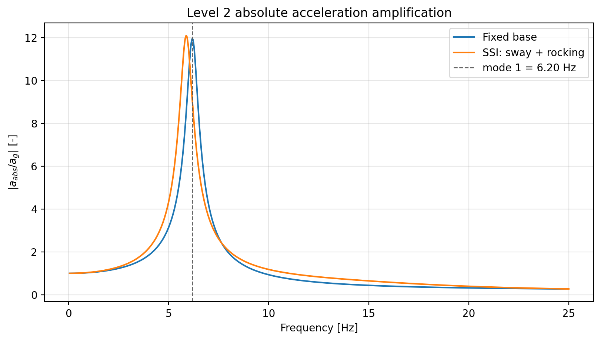

# Q6

## a) Response spectrum analysis with elastic foundation support

The dynamic SSI effects were first approximated in RFEM by replacing the fixed base with a thick rigid foundation block supported by distributed elastic springs. This is a simplified RSA model: the structure is still analysed using the EC8 response spectrum, but the support is no longer perfectly fixed.

### Soil and Foundation Properties

The soil properties are taken from the Part 2 geotechnical investigation:

| Property | Value |
| --- | ---: |
| Shear-wave velocity $V_{s,30}$ | $160\ \mathrm{m/s}$ |
| Soil density $\rho$ | $1800\ \mathrm{kg/m^3}$ |
| Poisson ratio $\nu$ | $0.33$ |
| SPT value $N_{SPT}$ | $10$ blows per $0.3\ \mathrm{m}$ |
| Undrained shear strength $c_u$ | $50\ \mathrm{kPa}$ |

The shear modulus used for the elastic half-space is obtained from

$$
G = \rho V_s^2 = 1800(160)^2 = 46.08\ \mathrm{MPa}.
$$

The RFEM foundation block has a contact area

$$
A_b = 18.603\ \mathrm{m^2}.
$$

For use with the half-space formulas, this area is replaced by an equivalent square foundation,

$$
A_b = (2B)^2,
\qquad
B = \sqrt{\frac{A_b}{4}} = 2.157\ \mathrm{m},
$$

so the equivalent square side length is

$$
2B = 4.313\ \mathrm{m}.
$$

### Elastic Spring Stiffness

Using the SSI guideline formulas for a square surface foundation, the horizontal and vertical static stiffnesses are approximated as

$$
K_y = \frac{9GB}{2-\nu},
\qquad
K_z = \frac{4.54GB}{1-\nu}.
$$

The rocking stiffness about the horizontal axis is

$$
K_{rx} = \frac{3.6GB^3}{1-\nu}.
$$

Substitution gives:

| Stiffness | Value | Use in RFEM model |
| --- | ---: | --- |
| $K_x = K_y$ | $5.36\times10^8\ \mathrm{N/m}$ | global horizontal support stiffness |
| $K_z$ | $6.73\times10^8\ \mathrm{N/m}$ | vertical support stiffness |
| $K_{rx}=K_{ry}$ | $2.48\times10^9\ \mathrm{N\,m/rad}$ | equivalent rocking flexibility |

For a distributed surface support, the translational stiffnesses are divided by the contact area:

$$
k_x = k_y = \frac{K_y}{A_b}=28.79\ \mathrm{MN/m^3},
\qquad
k_z = \frac{K_z}{A_b}=36.20\ \mathrm{MN/m^3}.
$$

These values were used as the elastic foundation support stiffnesses. The rocking flexibility is not entered as an independent spring in the distributed-support model; it emerges from the deformation pattern of the spring-supported rigid foundation block.

### RSA Results with Foundation Springs

The response spectrum analysis with the elastic foundation support gave the following maximum deformations:

| Response quantity | Value | Location |
| --- | ---: | --- |
| Maximum displacement in $X$ | $1.5\ \mathrm{mm}$ | Member 30, $x=2.470\ \mathrm{m}$ |
| Maximum displacement in $Y$ | $23.8\ \mathrm{mm}$ | Member 230, $x=1.150\ \mathrm{m}$ |
| Maximum displacement in $Z$ | $3.1\ \mathrm{mm}$ | FE node 186, $(-0.680,\ 2.613,\ 0.000)\ \mathrm{m}$ |
| Maximum vectorial displacement | $23.9\ \mathrm{mm}$ | Member 28, $x=2.470\ \mathrm{m}$ |
| Maximum rotation about $X$ | $5.1\ \mathrm{mrad}$ | Member 27, $x=0.741\ \mathrm{m}$ |
| Maximum rotation about $Y$ | $0.8\ \mathrm{mrad}$ | Member 193, $x=0.214\ \mathrm{m}$ |
| Maximum rotation about $Z$ | $1.7\ \mathrm{mrad}$ | Member 462, $x=0.643\ \mathrm{m}$ |

The governing displacement remains the lateral displacement in the global $Y$ direction. This is consistent with the modal basis used earlier, where the dominant horizontal mode also acted mainly in the global $Y$ direction.

### Comparison with the Fixed-Base RSA of Q5

Compared with the fixed-base RSA results of Q5, the elastic-foundation model gives:

| Response quantity | Fixed-base Q5 | Elastic foundation Q6a | Change |
| --- | ---: | ---: | ---: |
| Maximum displacement in $X$ | $6.5\ \mathrm{mm}$ | $1.5\ \mathrm{mm}$ | $-77\%$ |
| Maximum displacement in $Y$ | $34.2\ \mathrm{mm}$ | $23.8\ \mathrm{mm}$ | $-30\%$ |
| Maximum displacement in $Z$ | $3.7\ \mathrm{mm}$ | $3.1\ \mathrm{mm}$ | $-16\%$ |
| Maximum vectorial displacement | $34.8\ \mathrm{mm}$ | $23.9\ \mathrm{mm}$ | $-31\%$ |
| Maximum rotation about $X$ | $22.5\ \mathrm{mrad}$ | $5.1\ \mathrm{mrad}$ | $-77\%$ |
| Maximum rotation about $Y$ | $2.0\ \mathrm{mrad}$ | $0.8\ \mathrm{mrad}$ | $-60\%$ |
| Maximum rotation about $Z$ | $6.4\ \mathrm{mrad}$ | $1.7\ \mathrm{mrad}$ | $-73\%$ |

The RFEM RSA result with elastic foundation support gives smaller maximum deformations than the fixed-base result from Q5. The maximum displayed global $Y$ displacement decreases from $34.2\ \mathrm{mm}$ to $23.8\ \mathrm{mm}$, and the maximum vectorial displacement decreases from $34.8\ \mathrm{mm}$ to $23.9\ \mathrm{mm}$.

This reduction should not be interpreted as a general rule that SSI always reduces response. It is a result of this particular response-spectrum model. Changing the support condition changes the modal periods, modal participation factors, and the spectral ordinates sampled by the modes. The distributed spring-supported foundation therefore modifies the modal combination, which in this case leads to lower peak RSA displacements and rotations.

## b) Frequency-domain generalized SDOF analysis

The second SSI assessment is performed in the frequency domain. The purpose is not to repeat the full RFEM response spectrum analysis, but to compare the fixed-base response with an equivalent generalized SDOF model that includes dynamic soil-foundation interaction.

### Step 1: Generalized SDOF Reduction

The structural part is reduced to the dominant RFEM mode in the major horizontal direction. The generalized displacement coordinate is denoted by $q(t)$, so the lateral displacement of a point at height $z_j$ is approximated as

$$
u_j(t) \approx \psi_j q(t).
$$

The RFEM modal data used for the reduced model are:

| Quantity | Value |
| --- | ---: |
| First-mode frequency $f_1$ | $6.20\ \mathrm{Hz}$ |
| Circular frequency $\omega_1$ | $38.956\ \mathrm{rad/s}$ |
| Generalized mass $m^\ast$ | $2422.5\ \mathrm{kg}$ |
| Effective modal mass in $Y$ | $8063.7\ \mathrm{kg}$ |
| Generalized load factor $L$ | $4419.8\ \mathrm{kg}$ |
| Generalized stiffness $k^\ast=m^\ast\omega_1^2$ | $3.676\times10^6\ \mathrm{N/m}$ |
| Damping ratio $\xi$ | $5\%$ |
| Generalized damping $c^\ast=2\xi\omega_1m^\ast$ | $9.437\times10^3\ \mathrm{Ns/m}$ |

The first-mode ordinates were obtained by averaging the normalized RFEM $u_Y$ displacements over all mesh nodes at each level. This is preferable to using a single reference node because the frame does not behave as a rigid diaphragm and the modal displacement varies across each level.

| Level | Height $z$ [m] | Normalized displacement $\psi$ |
| --- | ---: | ---: |
| 1 | $2.47$ | $0.42672$ |
| 2 | $4.94$ | $0.65253$ |

*Figure 1. First RFEM mode shape used to recover the response at the two levels. The markers show the level-averaged modal ordinates, while the horizontal bars show the range of mesh-node values at each level.*

The ideal input for this calculation would be a complete RFEM nodal mass export: a table listing each relevant mass node, its lumped translational mass, its height coordinate, and its mode-1 displacement ordinate. With that information, the generalized quantities could be computed directly by summing over all nodes. Since only the mode-shape ordinates were available, the missing mass moments were estimated using a two-level surrogate. The two unknown level masses were fitted such that the known generalized mass $m^\ast$ and generalized load factor $L$ are reproduced:

$$
m^\ast = m_1\psi_1^2 + m_2\psi_2^2,
\qquad
L = m_1\psi_1 + m_2\psi_2.
$$

This gives:

| Quantity | Value |
| --- | ---: |
| $m_1$ at level 1 | $4789.7\ \mathrm{kg}$ |
| $m_2$ at level 2 | $3641.0\ \mathrm{kg}$ |
| $H$ | $16785.3\ \mathrm{kg\,m}$ |
| $M_r$ | $54939.8\ \mathrm{kg}$ |
| $S$ | $53071.9\ \mathrm{kg\,m}$ |
| $J$ | $205679.8\ \mathrm{kg\,m^2}$ |

This approximation is acceptable for the present frequency-domain comparison because it preserves the modal mass and modal participation of the dominant mode. A more refined model would replace this surrogate with the full RFEM nodal mass distribution.

### Step 2: Soil Dynamic Stiffness

The soil is modeled as a homogeneous half-space. The properties are taken from the Part 2 geotechnical investigation:

| Property | Value |
| --- | ---: |
| Shear-wave velocity $V_s$ | $160\ \mathrm{m/s}$ |
| Soil density $\rho$ | $1800\ \mathrm{kg/m^3}$ |
| Poisson ratio $\nu$ | $0.33$ |

The corresponding shear modulus is

$$
G = \rho V_s^2 = 46.08\ \mathrm{MPa}.
$$

The RFEM foundation contact area is converted to an equivalent square foundation:

$$
A_b = 18.603\ \mathrm{m^2},
\qquad
B = \sqrt{\frac{A_b}{4}}=2.157\ \mathrm{m}.
$$

For a square surface foundation, the static horizontal and rocking stiffnesses are

$$
K_y=\frac{9GB}{2-\nu},
\qquad
K_{rx}=\frac{3.6GB^3}{1-\nu}.
$$

Numerically,

$$
K_y = 5.355\times 10^8\ \mathrm{N/m},
\qquad
K_{rx}=2.483\times 10^9\ \mathrm{N\,m/rad}.
$$

The dynamic stiffness terms are written as

$$
\tilde{k}_{yy}(\omega)=K_y + i\omega C_y,
$$

$$
\tilde{k}_{\theta\theta}(\omega)=K_{rx}(1-0.20a_0)+i\omega C_{rx},
\qquad
a_0=\frac{\omega B}{V_s}.
$$

The radiation dashpots are estimated from the dimensional forms in the SSI guideline:

$$
C_y \approx \rho V_s A_b,
\qquad
C_{rx} \approx \rho V_p I_{bx}.
$$

The chart multipliers were taken as 1.0 because the SSI charts were not digitized. This gives:

| Quantity | Value |
| --- | ---: |
| $C_y$ | $5.358\times10^6\ \mathrm{Ns/m}$ |
| $C_{rx}$ | $1.649\times10^7\ \mathrm{Nms/rad}$ |

The coupling terms $\tilde{k}_{y\theta}$ and $\tilde{k}_{\theta y}$ are neglected because the equivalent square foundation is assumed centered and symmetric.

### Step 3: Coupled Frequency-Domain Equations

The unknown frequency-domain coordinates are

$$
\mathbf{X}(\omega)=
\begin{bmatrix}
Q(\omega)\\
U_l(\omega)\\
\Theta_l(\omega)
\end{bmatrix},
$$

where:

- $Q(\omega)$ is the generalized structural deformation.
- $U_l(\omega)$ is the additional horizontal foundation translation caused by SSI.
- $\Theta_l(\omega)$ is the additional rocking rotation caused by SSI.

Following the lecture notation, the free-field ground acceleration is the known input. The reference peak ground acceleration from Q3 is

$$
a_{gR}=(0.35+0.01C)g=(0.35+0.01)g=0.36g.
$$

For importance class IV, the importance factor is

$$
\gamma_I=1.4.
$$

Therefore, the design acceleration used in the notebook is

$$
\tilde{a}_g = \gamma_I a_{gR}=1.4(0.36g)=0.504g = 4.944\ \mathrm{m/s^2}.
$$

The coupled system is

$$
\left[
\begin{array}{ccc}
k^\ast+i\omega c^\ast-\omega^2m^\ast & -\omega^2L & -\omega^2H\\
-\omega^2L & \tilde{k}_{yy}-\omega^2M_r & \tilde{k}_{y\theta}-\omega^2S\\
-\omega^2H & \tilde{k}_{\theta y}-\omega^2S & \tilde{k}_{\theta\theta}-\omega^2J
\end{array}
\right]
\mathbf{X}
=
-\tilde{a}_g
\begin{bmatrix}
L\\
M_r\\
S
\end{bmatrix}.
$$

This is the generalized form of the lecture equations. The top equation is the equilibrium of the structural generalized mass, while the second and third equations are the horizontal force and rocking moment balances at the soil-foundation interface.

### Step 4: Fixed-Base Reference Case

To isolate the effect of SSI, the same generalized SDOF model is also solved without foundation flexibility:

$$
\left(k^\ast+i\omega c^\ast-\omega^2m^\ast\right)Q_{fb}
=
-L\tilde{a}_g.
$$

This comparison is important because it keeps the structural reduction and input motion identical. The only difference is whether the soil-foundation degrees of freedom $U_l$ and $\Theta_l$ are included.

### Step 5: Response Recovery

Once $Q$, $U_l$, and $\Theta_l$ are known, the relative displacement at a reference height is recovered as

$$
U_{\mathrm{rel},j}(\omega)
=
\psi_jQ(\omega)+U_l(\omega)+z_j\Theta_l(\omega).
$$

The absolute displacement also includes the free-field ground displacement,

$$
U_{\mathrm{abs},j}(\omega)
=
U_g(\omega)+U_{\mathrm{rel},j}(\omega),
\qquad
U_g(\omega)=-\frac{\tilde{a}_g}{\omega^2}.
$$

The absolute acceleration is then

$$
A_{\mathrm{abs},j}(\omega)
=
-\omega^2U_{\mathrm{abs},j}(\omega).
$$

### Step 6: Results

The dynamic stiffness and displacement response obtained from the notebook are shown in Figure 2.

*Figure 2. Dynamic soil stiffness terms and level 2 displacement response.*

The displacement response for the Q3 design PGA is shown separately in Figure 3.

*Figure 3. Displacement response at the two levels for $a_g=0.504g$.*

The corresponding acceleration amplification is shown in Figure 4.

*Figure 4. Absolute acceleration amplification for the fixed-base and SSI generalized SDOF models.*

The numerical peak response at level 2 is:

| Quantity | Fixed-base model | SSI model |
| --- | ---: | ---: |
| Peak acceleration amplification $\lvert a_{\mathrm{abs}}/a_g\rvert$ | $11.954$ | $12.095$ |
| Frequency at acceleration peak | $6.190\ \mathrm{Hz}$ | $5.881\ \mathrm{Hz}$ |
| Maximum relative displacement amplitude | $38.832\ \mathrm{mm}$ | $43.693\ \mathrm{mm}$ |

### Interpretation

The SSI model shifts the peak response from approximately $6.19\ \mathrm{Hz}$ to $5.88\ \mathrm{Hz}$. This reduction in frequency is physically expected because foundation translation and rocking add flexibility to the system. The response is therefore slightly softer than the fixed-base model.

The maximum relative displacement increases from $38.8\ \mathrm{mm}$ to $43.7\ \mathrm{mm}$, which is an increase of about $12.5\%$. The acceleration amplification remains close to the fixed-base value, increasing only from $11.954$ to $12.095$. This indicates that, for the assumed foundation size and soil properties, SSI has a clearer effect on displacement and resonant frequency than on the peak acceleration amplification.

The frequency-domain result should not be compared one-to-one with the RFEM RSA displacement from part (a), because part (a) is a multimodal response-spectrum result while part (b) is a single generalized SDOF frequency sweep. The useful comparison is qualitative: both calculations show that SSI changes the dynamic characteristics of the system. In the generalized SDOF model this appears as a lower resonant frequency and a larger modal displacement amplitude; in the RFEM RSA model it appears as a changed deformation pattern with lower displayed peak deformation values for the selected response-spectrum case.

The main limitations are the two-level mass surrogate and the approximate SSI radiation coefficients. A more refined calculation would use the full RFEM nodal mass export and digitized chart values for $k_y(a_0)$, $C_y(a_0)$, and $C_{rx}(a_0)$.
