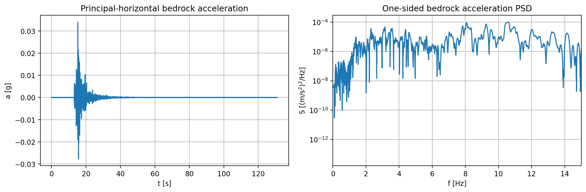
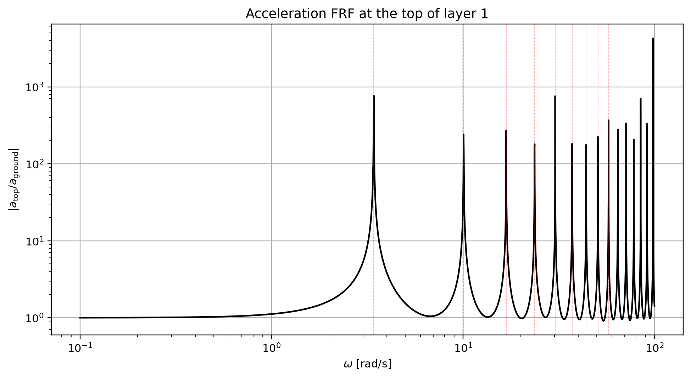
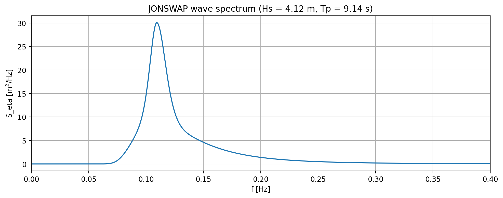
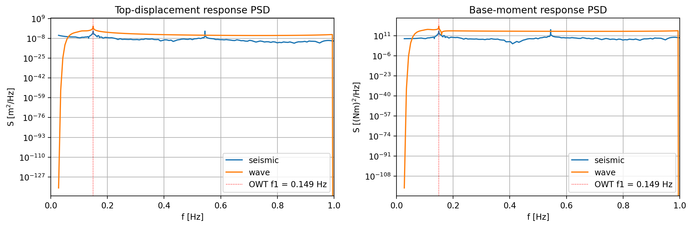
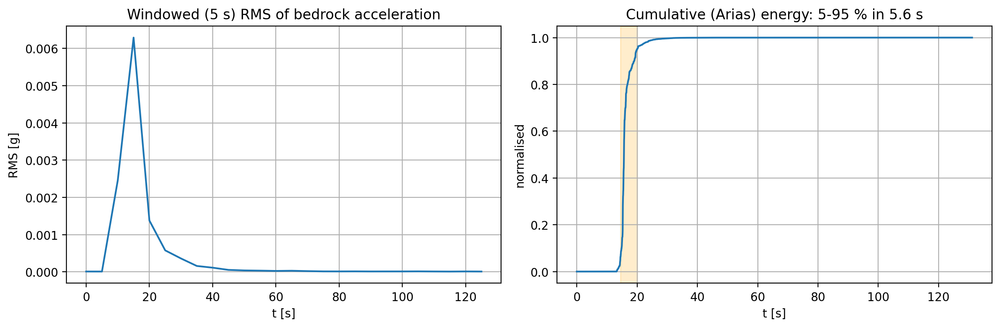
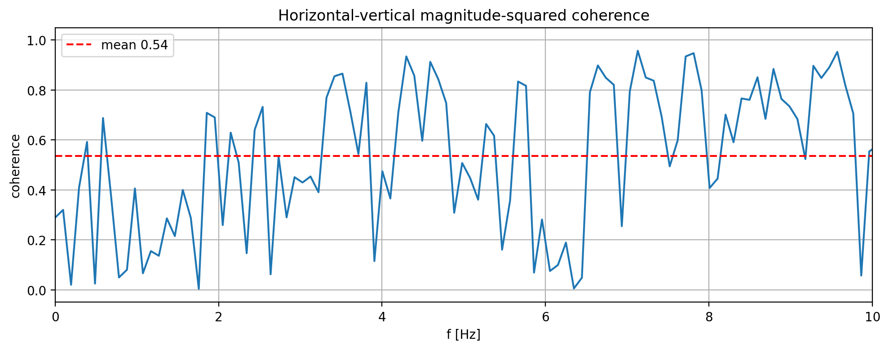

# Q1

## Governing Equations for the Layered Soil System

The layered soil is modeled as a one-dimensional shear beam subjected to vertically propagating SH waves. The horizontal displacement in each layer is denoted by $u_i(z,t)$, where $z$ is the depth coordinate measured downward from the ground surface. For the three soil layers, neglecting damping, the equations of motion are

$$
\rho_i \frac{\partial^2 u_i}{\partial t^2} - G_i \frac{\partial^2 u_i}{\partial z^2} = 0,
\qquad i = 1,2,3,
$$

or equivalently

$$
\frac{\partial^2 u_i}{\partial t^2} - c_i^2 \frac{\partial^2 u_i}{\partial z^2} = 0,
\qquad
c_i = \sqrt{\frac{G_i}{\rho_i}},
$$

where $G_i$ is the shear modulus, $\rho_i$ is the mass density, and $c_i$ is the SH-wave velocity of layer $i$.

Let the layer thicknesses be $H_1$, $H_2$, and $H_3$, so that the interfaces are located at

$$
z = H_1, \qquad z = H_1 + H_2,
$$

and the bedrock is located at

$$
z = H = H_1 + H_2 + H_3.
$$

*Figure 1. Schematic three-layer soil column used in the SH-wave formulation, with a free surface at the top and a prescribed kinematic input motion at the bedrock. The drawing is not to scale.*

## Boundary and Interface Conditions

At the free ground surface, the shear stress must vanish. Since $\tau = G\,\partial u / \partial z$, this gives

$$
\tau_1(0,t) = G_1 \frac{\partial u_1}{\partial z}(0,t) = 0
\quad \Rightarrow \quad
\frac{\partial u_1}{\partial z}(0,t) = 0.
$$

At each interface, both displacement and shear stress must be continuous. Therefore, at $z = H_1$,

$$
u_1(H_1,t) = u_2(H_1,t),
$$

$$
G_1 \frac{\partial u_1}{\partial z}(H_1,t) =
G_2 \frac{\partial u_2}{\partial z}(H_1,t),
$$

and at $z = H_1 + H_2$,

$$
u_2(H_1 + H_2,t) = u_3(H_1 + H_2,t),
$$

$$
G_2 \frac{\partial u_2}{\partial z}(H_1 + H_2,t) =
G_3 \frac{\partial u_3}{\partial z}(H_1 + H_2,t).
$$

At the bedrock level, the input motion is prescribed. If the bedrock displacement is $u_g(t)$, the kinematic boundary condition is

$$
u_3(H,t) = u_g(t).
$$

If the input is instead given as a bedrock acceleration $a_g(t)$, then

$$
\ddot{u}_g(t) = a_g(t),
$$

and the same boundary condition can be written in terms of the corresponding displacement history.

## Frequency-Domain Form

To derive the harmonic response, assume

$$
u_i(z,t) = U_i(z)e^{i\omega t}.
$$

Substitution into the equations of motion gives, for each layer,

$$
U_i''(z) + \left(\frac{\omega}{c_i}\right)^2 U_i(z) = 0,
\qquad i = 1,2,3.
$$

The corresponding general solutions are

$$
U_i(z) = A_i \sin\left(\frac{\omega z}{c_i}\right)
+ B_i \cos\left(\frac{\omega z}{c_i}\right),
\qquad i = 1,2,3.
$$

The boundary and interface conditions in the frequency domain become

$$
\begin{aligned}
U_1'(0) &= 0, \\
U_1(H_1) &= U_2(H_1), \\
G_1 U_1'(H_1) &= G_2 U_2'(H_1), \\
U_2(H_1 + H_2) &= U_3(H_1 + H_2), \\
G_2 U_2'(H_1 + H_2) &= G_3 U_3'(H_1 + H_2), \\
U_3(H) &= U_g.
\end{aligned}
$$

The bedrock excitation is prescribed as a harmonic acceleration

$$
a_g(t) = a_0 e^{i\omega t}.
$$

Since

$$
a_g(t) = \ddot{u}_g(t) = -\omega^2 U_g e^{i\omega t},
$$

the bedrock displacement amplitude is

$$
U_g = -\frac{a_0}{\omega^2},
$$

so the bottom boundary condition becomes

$$
U_3(H) = -\frac{a_0}{\omega^2}.
$$

This set of equations, together with the six boundary and interface conditions, fully defines the one-dimensional SH-wave propagation problem in the three-layer soil column.

# Q2

## Natural Frequencies and Modes of Vibration

Using the frequency-domain solutions from Q1 together with the six boundary and interface conditions, the unknown integration constants can be collected into the vector

$$
\mathbf{C} = [C_1,\; C_2,\; C_3,\; C_4,\; C_5,\; C_6]^T.
$$

This leads to the homogeneous algebraic system

$$
\mathbf{A}(\omega)\mathbf{C} = \mathbf{0}.
$$

For a non-trivial mode shape, the constant vector $\mathbf{C}$ must be different from zero. Therefore, the natural frequencies are obtained from the frequency equation

$$
\det\bigl(\mathbf{A}(\omega)\bigr) = 0.
$$

The symbolic coefficient matrix is constructed directly from the six equations using `sympy.linear_eq_to_matrix`, after which the roots of $\det(\mathbf{A})$ are found numerically by scanning in frequency and refining each sign change with bisection.

The soil properties used here are the assignment values corresponding to the student-number digits,

$$
H_1 = 8\ \text{m}, \qquad H_2 = 65\ \text{m}, \qquad H_3 = 43\ \text{m},
$$

with

$$
G_1 = 150\ \text{MPa}, \qquad
G_2 = 110\ \text{MPa}, \qquad
G_3 = 120\ \text{MPa},
$$

and

$$
\rho_1 = 1650\ \text{kg/m}^3, \qquad
\rho_2 = 1850\ \text{kg/m}^3, \qquad
\rho_3 = 1900\ \text{kg/m}^3.
$$

The first 10 natural frequencies obtained from the notebook are listed below.

| Mode | omega_n [rad/s] | f_n [Hz] |
| --- | ---: | ---: |
| 1 | 3.41964 | 0.54425 |
| 2 | 10.07663 | 1.60374 |
| 3 | 16.80455 | 2.67453 |
| 4 | 23.64545 | 3.76329 |
| 5 | 30.29954 | 4.82232 |
| 6 | 37.13594 | 5.91037 |
| 7 | 43.95543 | 6.99572 |
| 8 | 50.65300 | 8.06167 |
| 9 | 57.56232 | 9.16133 |
| 10 | 64.31951 | 10.23677 |

For each natural frequency, the corresponding mode shape is obtained by substituting $\omega = \omega_n$ back into the homogeneous system and solving for the constant vector $\mathbf{C}$ up to an arbitrary scaling factor. In the notebook, one constant is fixed to set the amplitude level, and each plotted mode is then normalized by its maximum absolute displacement.

*Figure 2. First 10 normalized natural mode shapes of the three-layer soil column. The dashed horizontal lines mark the interfaces between layers 1 and 2, and between layers 2 and 3.*

The first mode is a smooth global deformation of the full soil column. With increasing mode number, more zero crossings appear and the curvature becomes more oscillatory, especially in the deeper layers. The discontinuity in material properties at the interfaces changes the local wavelength of the mode shapes, which is why the slope and curvature visibly change from one layer to another.

## Effect of Soil Damping

In the present modal analysis, soil damping is neglected. If damping is included, the shear modulus becomes complex,

$$
G_i^{*}(\omega) = G_i + i\omega\eta_i.
$$

Then the eigenvalue problem is no longer purely real. The main consequences are:

- The natural frequencies become complex-valued. For light damping, the real part represents the damped oscillation frequency and is usually slightly lower than the undamped frequency.
- The imaginary part of the eigenvalue introduces exponential decay in time, so the free vibrations are no longer sustained standing waves.
- The mode shapes become complex-valued, which means that they describe not only amplitude variation with depth but also phase variation.
- In the frequency response, damping reduces the resonance amplitudes and broadens the peaks, while the sharp phase jumps of the undamped case become smooth transitions.

Therefore, including soil damping does not radically change the qualitative modal pattern for small damping, but it does introduce decay, a slight downward shift of the natural frequencies, and depth-dependent phase lag in the mode shapes.

# Q3

## Frequency Response Functions of the Layered Soil System

For the forced-response problem, the same layer-wise equations and the same general solutions from Q1 are used. The only change is the bedrock boundary condition, which is now prescribed by the seismic input motion.

Assume a harmonic bedrock acceleration

$$
a_g(t) = a_0 e^{i\omega t}.
$$

Because acceleration and displacement are related through

$$
a(t) = \ddot{u}(t) = -\omega^2 U e^{i\omega t},
$$

the corresponding bedrock displacement amplitude is

$$
U_g = -\frac{a_0}{\omega^2}.
$$

Therefore, the bottom boundary condition becomes

$$
U_3(H) = -\frac{a_0}{\omega^2}.
$$

The forced system can again be written in matrix form,

$$
\mathbf{A}(\omega)\mathbf{C} = \mathbf{b}(\omega),
$$

where the coefficient matrix $\mathbf{A}(\omega)$ is the same as in the free-vibration problem, while the right-hand side changes because of the prescribed bedrock motion.

The displacement frequency response function is defined as

$$
H(z,\omega) = \frac{U(z)}{U_g}.
$$

Substituting the bedrock displacement amplitude gives

$$
H(z,\omega) = -\frac{\omega^2 U(z)}{a_0}.
$$

Hence, in this harmonic formulation, the same complex ratio also represents the acceleration FRF,

$$
H(z,\omega) = \frac{a(z)}{a_g}.
$$

In the notebook, the FRFs are evaluated at:

- the top of layer 1, i.e. the ground surface, $z = 0$
- the top of layer 3, i.e. the interface between layers 2 and 3, $z = H_1 + H_2$

*Figure 3. Amplitude and phase of the normalized FRF at the top of layer 1 (surface) and at the top of layer 3. The dashed red lines mark the natural frequencies found in Q2.*

## Comparison Between the Two Locations

At the surface, the FRF amplitude is generally larger. This is expected because the upward-propagating wave passes through the full soil column and is further amplified by reflection at the free surface. The surface therefore shows the strongest resonance peaks.

At the top of layer 3, the response is closer to the imposed bedrock motion and does not yet include the full amplification produced by the upper two layers. As a result, the amplitude is usually smaller than at the surface. In addition, the FRF at the top of layer 3 exhibits deeper minima between resonances. These minima are anti-resonances caused by partial cancellation between upward and downward traveling wave components at that depth.

The resonance peaks in both curves occur close to the natural frequencies derived in Q2, which confirms the consistency between the modal analysis and the forced-response analysis.

## Physical Meaning of the Phase

The phase of $H(z,\omega)$ gives the phase difference between the local soil response at depth $z$ and the harmonic bedrock input motion. In other words, it indicates whether the response is in phase with the input or lags by part of a cycle.

For the undamped model used here, the FRF is essentially real-valued apart from numerical roundoff. Therefore, the phase is mostly either

$$
0^\circ \quad \text{or} \quad 180^\circ,
$$

which means:

- $0^\circ$: the local response is in phase with the bedrock input
- $180^\circ$: the local response is out of phase with the bedrock input

The abrupt jumps between these two values occur when the response changes sign, which typically happens across resonances or anti-resonances. At the top of layer 3 these phase flips occur more frequently because that location shows stronger local cancellations. At the surface the phase changes are more regular and closely tied to the global resonant behavior of the full soil column.

If damping were included, the FRF would become genuinely complex-valued, the resonant peaks would become finite and broader, and the phase jumps would no longer be abrupt. Instead, they would become smooth transitions through the resonant regions.

# Q4

## Random-Vibration Model and Assumptions

For Q4, the OWT is treated as a linear structure subjected to three load contributions:

- a constant wind force at the tower top, which produces the **mean** structural response
- a seismic base excitation, represented by the **surface** acceleration PSD obtained from the bedrock record after propagation through the layered soil column of Q3
- a wave excitation, represented by a JONSWAP wave-elevation PSD and transformed into a distributed Morison inertia load along the submerged part of the tower

The seismic and wave loads are assumed **uncorrelated**, so their response variances are added. The response is further assumed Gaussian when exceedance probabilities are evaluated.

## Input Data and Model Parameters

The variance and mean value calculation is built from the input chain

$$
S_{a,\mathrm{surf}}(f)=\left|H_{\mathrm{soil}}(0,\omega)\right|^2 S_{a,\mathrm{bed}}(f),
\qquad
S_Y(f)=\left|H_Y(f)\right|^2 S_{\mathrm{in}}(f),
$$

where the bedrock PSD comes from the Groningen record, the soil transfer function comes from Q3, and the wave loading is described by a JONSWAP spectrum converted into a distributed inertia load on the submerged tower.

### Seismic input at bedrock

- Record used: `NL.G192..ALL.2018-01-08.dat`
- Input direction: principal horizontal component obtained from the two recorded horizontal channels
- PSD convention: one-sided PSD, converted from `g` to `m/s^2`
- Peak ground acceleration of the principal component: about $0.0341\,g$

*Figure 4. Principal horizontal Groningen bedrock record used as seismic input and its one-sided PSD.*

### Soil amplification model from Q3

The bedrock motion is propagated through the same three-layer SH-wave soil column used in Q1 to Q3. The relevant properties are:

| Layer | Thickness H_j [m] | G_j [MPa] | rho_j [kg/m3] | eta_j [Ns/m2] |
| --- | ---: | ---: | ---: | ---: |
| 1 | 8 | 150 | 1650 | 1010 |
| 2 | 65 | 110 | 1850 | 1020 |
| 3 | 43 | 120 | 1900 | 1010 |

The resulting transfer function is the surface-to-bedrock acceleration ratio. This is the amplification filter used to obtain the seismic PSD at the OWT foundation level.

*Figure 5. Soil amplification FRF used to transform the bedrock seismic PSD into the surface seismic PSD.*

### Wave input

The wave loading is based on the JONSWAP spectrum from the Wind and Waves assignment, unit 2, load case 2:

| Parameter | Value |
| --- | ---: |
| Significant wave height H_s | 4.12 m |
| Peak period T_p | 9.14 s |
| Peak-enhancement factor gamma | 3.3 |
| Water density rho_w | 1025 kg/m3 |
| Morison inertia coefficient C_m | 2.0 |

Only the inertia contribution is retained in the linear random-vibration model, so the wave-elevation PSD is converted into an equivalent distributed load PSD over the submerged part of the tower.

*Figure 6. Wave-elevation spectrum used to construct the distributed hydrodynamic load PSD.*

### OWT finite-element model

The structural model used for Q4.1 is a linear Euler-Bernoulli beam model with translational and rotational DOFs at each node. The main parameters are summarized below.

| Category | Parameter | Value |
| --- | --- | ---: |
| Material | Steel modulus E_t | 210 GPa |
| Material | Steel density rho_t | 7850 kg/m3 |
| Damping | Modal damping ratio xi_t | 0.001 |
| Geometry | Water depth H_w | 35 m |
| Geometry | Tower height above water H_t | 146 m |
| Geometry | Total modeled height | 181 m |
| Submerged section | D_out,1 / D_in,1 | 9.10 / 8.96 m |
| Submerged section | Area A_1 / inertia I_1 | 1.986 m2 / 20.242 m4 |
| Air section | D_out,2 / D_in,2 | 7.10 / 7.00 m |
| Air section | Area A_2 / inertia I_2 | 1.107 m2 / 6.881 m4 |
| Lumped top properties | Nacelle mass M | 8.5 x 10^5 kg |
| Lumped top properties | Nacelle inertia J | 3.0 x 10^8 kg m2 |
| Discretization | Beam elements | 12 |
| Discretization | Nodes / total DOFs | 13 / 26 |
| Static mean load | Wind force F_w | 2.0 x 10^5 N |
| Dynamic model check | First four natural frequencies | 0.149, 1.058, 2.494, 4.736 Hz |

## Q4.1 Mean and Variance of Top Displacement and Base Moment

For a generic response quantity $Y$, the variance is obtained from the corresponding response FRF and the one-sided input PSD:

$$
\sigma_Y^2 = \int_0^\infty |H_Y(f)|^2 S_{\mathrm{in}}(f)\,df.
$$

Since the wave and seismic loads are taken as uncorrelated,

$$
\sigma_Y^2 = \sigma_{Y,\mathrm{seis}}^2 + \sigma_{Y,\mathrm{wave}}^2.
$$

The mean response is produced only by the static wind load. Therefore,

$$
\mu_{u,\mathrm{top}} = u_{\mathrm{static}},
\qquad
\mu_{M,\mathrm{base}} = M_{\mathrm{static}}.
$$

The numerical results from the notebook are summarized below.

| Response quantity | Mean | Standard deviation | Variance |
| --- | ---: | ---: | ---: |
| Top displacement u_top | 187.8 mm | 467.1 mm | 2.18 x 10^-1 m2 |
| Base moment M_base | 36.20 MNm | 102.57 MNm | 1.05 x 10^16 (Nm)^2 |

The decomposition of the standard deviations shows that the wave contribution dominates the dynamic response:

- for top displacement: seismic contribution $\approx 3.6\ \mathrm{mm}$, wave contribution $\approx 467.1\ \mathrm{mm}$
- for base moment: seismic contribution $\approx 5.98\ \mathrm{MNm}$, wave contribution $\approx 102.40\ \mathrm{MNm}$

*Figure 7. One-sided response PSDs for top displacement and base moment. The orange wave-induced PSD dominates both responses, while the red dotted line marks the first OWT natural frequency at $0.149\ \mathrm{Hz}$.*

Figures 4 to 7 show why the variance is wave-dominated. The JONSWAP peak is located close to the first OWT natural frequency, so the lightly damped structural mode is strongly excited by the waves. In contrast, the seismic energy content is much smaller at that frequency; after soil amplification, its dominant energy remains closer to the soil-mode range and therefore contributes little to the OWT response. The convergence check in the notebook also shows that the computed top-displacement standard deviation is insensitive to frequency-grid refinement, which confirms that the narrow resonant peak is sufficiently resolved.

## Q4.2 Probability of Exceedance

The response is assumed normally distributed.

For the base bending stress,

$$
\sigma_{\mathrm{base}} = \frac{M_{\mathrm{base}}}{W},
$$

with yield-limit threshold

$$
0.8\,\sigma_y = 0.8\times 355 = 284\ \mathrm{MPa}.
$$

For the top acceleration, the threshold is

$$
0.2\,g = 1.962\ \mathrm{m/s^2}.
$$

Using the executed notebook results:

- mean base stress: $\mu_\sigma = 8.14\ \mathrm{MPa}$
- standard deviation of base stress: $\sigma_\sigma = 23.06\ \mathrm{MPa}$
- standard deviation of top acceleration: $\sigma_a = 0.444\ \mathrm{m/s^2}$

the exceedance probabilities are:

$$
P\left(|\sigma_{\mathrm{base}}| > 0.8\,\sigma_y\right) = 2.72\times 10^{-33},
$$

$$
P\left(|a_{\mathrm{top}}| > 0.2\,g\right) = 9.97\times 10^{-6}.
$$

These values show that yielding at the tower base is effectively impossible within the adopted random-vibration model, and that exceedance of the $0.2\,g$ top-acceleration threshold is very unlikely.

## Q4.3 Is the Assumption of Stationarity and Ergodicity Appropriate?

To assess the stationarity assumption, the Groningen bedrock record was post-processed in two ways:

- a moving 5 s RMS was computed to quantify the time variation of signal intensity
- the cumulative Arias-type energy curve was used to identify the time interval containing the main energy burst

*Figure 8. Windowed RMS and cumulative normalized energy of the principal horizontal bedrock motion.*

The results show that the record is strongly non-stationary:

- the 5 s RMS varies by a factor of about $839$
- the interval containing $5\%$ to $95\%$ of the cumulative energy lasts only about $5.6\ \mathrm{s}$ out of a total record length of about $131\ \mathrm{s}$

This means that the signal energy is concentrated in a short burst rather than being statistically steady over time. Strict wide-sense stationarity is therefore **not** satisfied by the full record.

Regarding ergodicity, a single recorded event is not sufficient to verify it rigorously, because ergodicity is a statement about equivalence between ensemble and time averages over many realizations. In practice, however, the stationary PSD remains a useful engineering approximation because it captures the average frequency content of the strong-motion phase that drives the structural response. Therefore, the assumptions of stationarity and ergodicity are not strictly valid, but they are acceptable as a simplified basis for linear random-vibration analysis.

## Q4.4 Can the Horizontal and Vertical Seismic PSDs Be Assumed Uncorrelated?

The notebook evaluates this assumption using:

- the zero-lag correlation coefficient between the principal horizontal and vertical accelerations
- the magnitude-squared coherence as a function of frequency

The corresponding numerical indicators are:

$$
\rho_{HV}(0) = 0.110,
$$

and an average coherence in the $0.1$ to $10\ \mathrm{Hz}$ band of

$$
\overline{\gamma^2_{HV}} \approx 0.54.
$$

*Figure 9. Magnitude-squared coherence between the principal horizontal and vertical bedrock accelerations.*

The low zero-lag correlation suggests weak instantaneous correlation in the time domain, but the coherence plot shows a moderate frequency-dependent coupling over a broad frequency range. Hence, the two components are **not strictly uncorrelated**.

For the present assignment, treating the horizontal and vertical PSDs as uncorrelated is a reasonable first approximation, especially if only the dominant horizontal response is sought. Nevertheless, it neglects real cross-correlation effects caused by the common seismic source, propagation path, and local site response. A more rigorous treatment would require the full cross-spectral density matrix of the input motion. Therefore, the uncorrelated assumption is acceptable for a first-order estimate, but it may slightly underestimate the combined seismic demand when horizontal and vertical responses interact.
